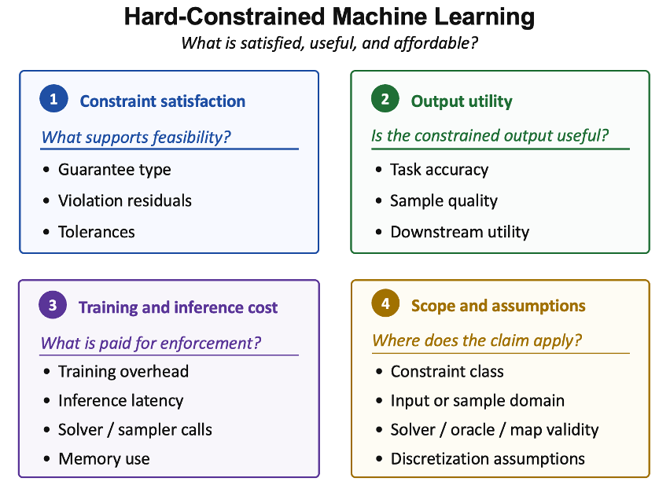

# Awesome Hard-Constrained Machine Learning

[](https://awesome.re)

**Survey paper preprint available soon.**

**We welcome missed papers and will keep this repository updated.**

> A reader-facing paper list and guide for hard-constrained machine learning, organized by the logic of the companion survey.


This README follows the survey's structure: preliminaries and evaluation terminology first, then hard-constrained predictive models, hard-constrained generative models, applications and benchmarks, and finally cross-cutting reading guides.

## Contents

- [Survey Logic](#survey-logic)
- [Reading Lens](#reading-lens)
- [Next Steps](#next-steps)
- [Related Surveys and Foundations](#related-surveys-and-foundations)
- [Part I: Hard-Constrained Predictive Models](#part-i-hard-constrained-predictive-models)
  - [Training-Based Approaches](#training-based-approaches)
  - [Post-Processing and Repair](#post-processing-and-repair)
  - [Structured NN Layers](#structured-nn-layers)
  - [Constraint Parameterization](#constraint-parameterization)
- [Part II: Hard-Constrained Generative Models](#part-ii-hard-constrained-generative-models)
  - [Push-Forward Generators](#push-forward-generators)
  - [Autoregressive Models](#autoregressive-models)
  - [Diffusion and Flow-Matching Models](#diffusion-and-flow-matching-models)
- [Applications and Benchmarks](#applications-and-benchmarks)
- [Reader Guides and Data](#reader-guides-and-data)
- [Citation](#citation)

## Survey Logic

| Survey section | Reader question | README role |
|---|---|---|
| Preliminaries | What are the model and constraint settings? | Foundation papers and evaluation terminology. |
| Hard-constrained predictive models | How can predictions or decisions be made feasible? | Four method families following Part I of the survey. |
| Hard-constrained generative models | How can valid samples be generated? | Push-forward, autoregressive, and diffusion/flow families. |
| Applications and benchmarks | Where do the claims matter in practice? | Optimization, science, and constrained synthesis examples. |
| Discussion | How should claims be interpreted? | Reading guides for guarantees, trade-offs, and failure modes. |

## Reading Lens

Every paper is easier to compare through four questions.
<!-- 
| Angle | Reader question | What to check |
|---|---|---|
| Constraint satisfaction | What supports feasibility? | Guarantee type, residuals, tolerances, certificates, validity rates. |
| Output utility | Is the constrained output useful? | Accuracy, objective gap, reward, sample quality, diversity, downstream utility. |
| Cost | What is paid for enforcement? | Training overhead, solver calls, repair iterations, sampler steps, latency, memory. |
| Scope and assumptions | Where does the claim apply? | Constraint class, domain, oracle, map validity, solver assumptions, discretization. | -->



## Next Steps

We plan to add a formula-level and implementation-level comparison for each method family.

- Add representative mathematical formulations for each method family.
- Add simple reference implementations or pseudocode for the core enforcement mechanism.
- Keep the examples minimal so readers can compare guarantee source, utility trade-off, and computational cost directly.

## Related Surveys and Foundations

### Related Surveys

#### 0.0 Survey and Background Papers

| # | Keywords | Paper | Venue | Year |
|---:|---|---|---|---:|
| 1 | geometric deep learning primer | <a href="https://doi.org/10.1109/MSP.2017.2693418">Geometric deep learning: going beyond euclidean data</a> | IEEE Signal Processing Magazine | 2017 |
| 2 | end-to-end constrained optimization | <a href="https://arxiv.org/pdf/2103.16378">End-to-end constrained optimization learning: A survey</a> | arXiv | 2021 |
| 3 | grids / groups / graphs / gauges | <a href="https://arxiv.org/pdf/2104.13478">Geometric deep learning: Grids, groups, graphs, geodesics, and gauges</a> | arXiv | 2021 |
| 4 | learning-to-optimize benchmark | <a href="https://arxiv.org/pdf/2103.12828">Learning to optimize: A primer and a benchmark</a> | arXiv | 2021 |
| 5 | ML for combinatorial optimization | <a href="https://doi.org/10.1016/j.ejor.2020.07.063">Machine learning for combinatorial optimization: a methodological tour d’horizon</a> | EJOR | 2021 |
| 6 | physics-informed ML overview | <a href="https://doi.org/10.1038/s42254-021-00314-5">Physics-informed machine learning</a> | Nat. Rev. Phys. | 2021 |
| 7 | RL for combinatorial optimization | <a href="https://doi.org/10.1016/j.cor.2021.105400">Reinforcement learning for combinatorial optimization: A survey</a> | COR | 2021 |
| 8 | ML-assisted meta-heuristics | <a href="https://doi.org/10.1016/j.ejor.2021.04.032">Machine learning at the service of meta-heuristics for solving combinatorial optimization problems: A state-of-the-art</a> | EJOR | 2022 |
| 9 | PIML problems / methods / applications | <a href="https://arxiv.org/pdf/2211.08064">Physics-informed machine learning: A survey on problems, methods and applications</a> | arXiv | 2022 |
| 10 | amortized continuous optimization | <a href="https://arxiv.org/pdf/2202.00665">Tutorial on amortized optimization for learning to optimize over continuous domains</a> | arXiv | 2022 |
| 11 | controllable text generation survey | <a href="https://arxiv.org/pdf/2408.12599">Controllable text generation for large language models: A survey</a> | arXiv | 2024 |
| 12 | decision-focused learning survey | <a href="https://doi.org/10.1613/jair.1.15320">Decision-focused learning: Foundations, state of the art, benchmark and future opportunities</a> | JAIR | 2024 |
| 13 | physics-informed computer vision | <a href="https://dl.acm.org/doi/10.1145/3689037">Physics-informed computer vision: A review and perspectives</a> | ACM CSUR | 2024 |
| 14 | PINN techniques and trends | <a href="https://doi.org/10.3390/ai5030074">Understanding physics-informed neural networks: techniques, applications, trends, and challenges</a> | AI | 2024 |
| 15 | contextual optimization survey | <a href="https://doi.org/10.1016/j.ejor.2024.03.020">A survey of contextual optimization methods for decision-making under uncertainty</a> | EJOR | 2025 |
| 16 | trustworthy optimization learning | <a href="https://doi.org/10.1515/9783111376776-009">Trustworthy optimization learning: a brief overview</a> | Mathematical Optimization for… | 2025 |
| 17 | physics-informed ML survey | <a href="https://doi.org/10.1007/s44379-025-00016-0">When physics meets machine learning: A survey of physics-informed machine learning</a> | Machine Learning for… | 2025 |

<!-- ### Foundations and Preliminaries

#### 0.1 Neural Networks and Model Foundations

| # | Keywords | Paper | Venue | Year |
|---:|---|---|---|---:|
| 1 | MLP universal approximation | <a href="https://doi.org/10.1016/0893-6080(89)90020-8">Multilayer feedforward networks are universal approximators</a> | Neural networks | 1989 |
| 2 | nonpolynomial activations | <a href="https://doi.org/10.1016/S0893-6080(05)80131-5">Multilayer feedforward networks with a nonpolynomial activation function can approximate any function</a> | Neural networks | 1993 |
| 3 | RNN universal approximation | <a href="https://doi.org/10.1007/11840817_66">Recurrent neural networks are universal approximators</a> | International conference on… | 2006 |
| 4 | deep CNN image recognition | <a href="https://dl.acm.org/doi/10.1145/3065386">ImageNet classification with deep convolutional neural networks</a> | CACM | 2017 |
| 5 | Transformer universality | <a href="https://arxiv.org/pdf/1912.10077">Are transformers universal approximators of sequence-to-sequence functions?</a> | arXiv | 2019 |
| 6 | deep narrow networks | <a href="https://proceedings.mlr.press/v125/kidger20a.html">Universal approximation with deep narrow networks</a> | COLT | 2020 |
| 7 | CNN universality | <a href="https://doi.org/10.1016/j.acha.2019.06.004">Universality of deep convolutional neural networks</a> | Applied and computational… | 2020 |
| 8 | set-function universality | <a href="https://jmlr.org/papers/v23/21-0730.html">Universal approximation of functions on sets</a> | JMLR | 2022 |
| 9 | geometric DL universality | <a href="https://jmlr.org/papers/v23/21-0716.html">Universal approximation theorems for differentiable geometric deep learning</a> | JMLR | 2022 |
| 10 | ResNet universal approximation | <a href="https://proceedings.mlr.press/v235/liu24am.html">Characterizing ResNet’s Universal Approximation Capability</a> | Proceedings of the Forty-first… | 2024 |

#### 0.2 Generative and Discriminative Model Foundations

| # | Keywords | Paper | Venue | Year |
|---:|---|---|---|---:|
| 1 | probabilistic ML foundations | Pattern recognition and machine learning | Springer | 2006 |
| 2 | graphical model foundations | Probabilistic graphical models: principles and techniques | MIT press | 2009 |
| 3 | variational autoencoder | <a href="https://arxiv.org/pdf/1312.6114">Auto-encoding variational bayes</a> | arXiv | 2013 |
| 4 | GAN foundation | <a href="https://proceedings.neurips.cc/paper_files/paper/2014/hash/f033ed80deb0234979a61f95710dbe25-Abstract.html">Generative adversarial nets</a> | NeurIPS | 2014 |
| 5 | normalizing flows | <a href="https://proceedings.mlr.press/v37/rezende15.html">Variational inference with normalizing flows</a> | ICML | 2015 |
| 6 | DDPM diffusion model | <a href="https://proceedings.neurips.cc/paper_files/paper/2020/hash/4c5bcfec8584af0d967f1ab10179ca4b-Abstract.html">Denoising diffusion probabilistic models</a> | NeurIPS | 2020 |
| 7 | score-based SDE generation | <a href="https://arxiv.org/pdf/2011.13456">Score-based generative modeling through stochastic differential equations</a> | arXiv | 2020 |
| 8 | flow matching foundation | <a href="https://arxiv.org/pdf/2210.02747">Flow matching for generative modeling</a> | arXiv | 2022 |
| 9 | rectified flow | <a href="https://arxiv.org/pdf/2209.03003">Flow straight and fast: Learning to generate and transfer data with rectified flow</a> | arXiv | 2022 |

#### 0.3 Constraint Classes and Optimization Theory

| # | Keywords | Paper | Venue | Year |
|---:|---|---|---|---:|
| 1 | convex optimization reference | Convex optimization | Cambridge university press | 2004 | -->

## Part I: Hard-Constrained Predictive Models

Predictive methods return decisions, labels, controls, trajectories, or optimization variables that should satisfy constraints.

| Family | Core mechanism | Typical guarantee basis | Main trade-off |
|---|---|---|---|
| Training-based approaches | Put feasibility pressure into training through penalties, barriers, Lagrangians, or safe updates. | Empirical residuals, dual/convergence statements, or safe-update assumptions. | Low inference cost but feasibility may depend on training coverage and assumptions. |
| Post-processing and repair | Correct raw predictions after inference through projection, repair, warm starts, or projection-analogous correction. | Solver tolerance, repair success, correction geometry, or empirical residual checks. | Stronger feasibility evidence but extra inference or correction cost. |
| Structured NN layers | Embed differentiable solvers, completion layers, or fixed-point operators. | KKT/solver conditions, layer validity, tolerance, differentiability assumptions. | Clear mechanism but can be solver-heavy or problem-specific. |
| Constraint parameterization | Parameterize outputs so feasible points are produced directly. | By-construction feasibility under valid parameterization or map assumptions. | Fast inference but coverage and geometry assumptions matter. |

### Training-Based Approaches

#### I.1.1 Soft-Penalty Training

| # | Keywords | Paper | Venue | Year |
|---:|---|---|---|---:|
| 1 | DeepOPF penalty training | <a href="https://doi.org/10.1109/SmartGridComm.2019.8909795">Deepopf: A deep neural network approach for security-constrained dc optimal power flow</a> | 2019 IEEE International… | 2019 |
| 2 | RL-CBF. | <a href="https://ojs.aaai.org/index.php/AAAI/article/view/4213">End-to-end safe reinforcement learning through barrier functions for safety-critical continuous control tasks</a> | AAAI | 2019 |
| 3 | predict-and-reconstruct. | <a href="https://doi.org/10.1109/TPWRS.2020.3026379">Deepopf: A deep neural network approach for security-constrained dc optimal power flow</a> | IEEE TPS | 2020 |
| 4 | fast AC-OPF penalty learning | <a href="https://doi.org/10.1109/SmartGridComm47815.2020.9303008">Learning optimal solutions for extremely fast AC optimal power flow</a> | 2020 IEEE International… | 2020 |
| 5 | Lagrangian-dual OPF prediction | <a href="https://ojs.aaai.org/index.php/AAAI/article/view/5403">Predicting ac optimal power flows: Combining deep learning and lagrangian dual methods</a> | AAAI | 2020 |
| 6 | convex NN DC-OPF solver | <a href="https://doi.org/10.1109/TCNS.2021.3124283">A convex neural network solver for dcopf with generalization guarantees</a> | IEEE TCNS | 2021 |
| 7 | AC-OPF physics-informed residuals | <a href="https://arxiv.org/pdf/2110.02672">Physics-Informed Neural Networks for AC Optimal Power Flow</a> | arXiv | 2021 |
| 8 | DC-OPF worst-case PINN | <a href="https://doi.org/10.1109/SmartGridComm51999.2021.9632308">Physics-informed neural networks for minimising worst-case violations in dc optimal power flow</a> | 2021 IEEE International… | 2021 |
| 9 | log-barrier constrained training | <a href="https://doi.org/10.23919/EUSIPCO55093.2022.9909927">Constrained deep networks: Lagrangian optimization via log-barrier extensions</a> | 2022 30th European Signal… | 2022 |
| 10 | worst-case violation training | <a href="https://arxiv.org/pdf/2212.10930">Minimizing worst-case violations of neural networks</a> | arXiv | 2022 |
| 11 | violation-driven data enrichment | <a href="https://doi.org/10.1109/PowerTech55446.2023.10202770">Enriching neural network training dataset to improve worst-case performance guarantees</a> | 2023 IEEE Belgrade PowerTech | 2023 |
| 12 | worst-case AC-OPF guarantees | <a href="https://arxiv.org/pdf/2510.23196">Neural Networks for AC Optimal Power Flow: Improving Worst-Case Guarantees during Training</a> | arXiv | 2025 |

#### I.1.2 Lagrangian-Based Training

| # | Keywords | Paper | Venue | Year |
|---:|---|---|---|---:|
| 1 | nonconvex constrained learning | <a href="https://doi.org/10.1109/TIT.2022.3187948">Constrained learning with non-convex losses</a> | IEEE Transactions on Information… | 2022 |
| 2 | AC-OPF Lagrangian learning | <a href="https://arxiv.org/pdf/2110.01653">Learning to solve the AC optimal power flow via a lagrangian approach</a> | arXiv | 2022 |
| 3 | resilient constrained learning | <a href="https://openreview.net/forum?id=h0RVoZuUl6">Resilient constrained learning</a> | NeurIPS | 2023 |
| 4 | equality-embedded dual OPF | <a href="https://arxiv.org/pdf/2306.06674">Self-supervised equality embedded deep lagrange dual for approximate constrained optimization</a> | arXiv | 2023 |
| 5 | self-supervised primal-dual learning. | <a href="https://ojs.aaai.org/index.php/AAAI/article/view/25520">Self-supervised primal-dual learning for constrained optimization</a> | AAAI | 2023 |
| 6 | constrained-learning algorithms | <a href="https://hdl.handle.net/1866/33886">Constrained optimization for machine learning: algorithms and applications</a> | PhD thesis | 2024 |
| 7 | dual-feasible completion. | <a href="https://openreview.net/forum?id=gN1iKwxlL5">Dual lagrangian learning for conic optimization</a> | NeurIPS | 2024 |
| 8 | deep augmented Lagrangian | <a href="https://arxiv.org/pdf/2403.03454">Learning constrained optimization with deep augmented lagrangian methods</a> | arXiv | 2024 |
| 9 | near-optimal constrained learning | <a href="https://openreview.net/forum?id=fDaLmkdSKU">Near-Optimal Solutions of Constrained Learning Problems</a> | ICLR | 2024 |
| 10 | security-constrained primal-dual OPF | <a href="https://doi.org/10.1109/TPWRS.2024.3498705">Self-supervised learning for large-scale preventive security constrained dc optimal power flow</a> | IEEE TPS | 2024 |
| 11 | augmented-Lagrangian constrained learning | <a href="https://arxiv.org/pdf/2510.20995">AL-CoLe: Augmented Lagrangian for Constrained Learning</a> | arXiv | 2025 |
| 12 | LLM constrained alignment | <a href="https://arxiv.org/pdf/2505.19387">Alignment of large language models with constrained learning</a> | arXiv | 2025 |
| 13 | approximately equivariant networks | <a href="https://arxiv.org/pdf/2505.13631">Learning (approximately) equivariant networks via constrained optimization</a> | arXiv | 2025 |
| 14 | pointwise-constrained OPF learning | <a href="https://arxiv.org/pdf/2510.20777">Learning Optimal Power Flow with Pointwise Constraints</a> | arXiv | 2025 |
| 15 | statistical equality constraints | <a href="https://arxiv.org/pdf/2511.14320">Learning with Statistical Equality Constraints</a> | arXiv | 2025 |
| 16 | feasible dual policy iteration | <a href="https://openreview.net/forum?id=BHSSV1nHvU">Breaking Safety Paradox with Feasible Dual Policy Iteration</a> | ICLR | 2026 |
| 17 | unrolled constrained optimization | <a href="https://arxiv.org/pdf/2601.17274">Unrolled Neural Networks for Constrained Optimization</a> | arXiv | 2026 |

#### I.1.3 Decision-Focused and Learned-Constraint Feasibility

| # | Keywords | Paper | Venue | Year |
|---:|---|---|---|---:|
| 1 | conformal MIP constraints | <a href="https://openreview.net/forum?id=ZvUZvT8tgg">Conformal Mixed-Integer Constraint Learning with Feasibility Guarantees</a> | NeurIPS | 2025 |
| 2 | decision-focused feasibility | <a href="https://openreview.net/forum?id=eTmvwxohRx">Feasibility-Aware Decision-Focused Learning for Predicting Parameters in the Constraints</a> | NeurIPS | 2025 |

#### I.1.4 Provable Training and Editing

| # | Keywords | Paper | Venue | Year |
|---:|---|---|---|---:|
| 1 | MIP neural verification | <a href="https://arxiv.org/pdf/1711.07356">Evaluating robustness of neural networks with mixed integer programming</a> | arXiv | 2017 |
| 2 | ReLU stability for verification | <a href="https://arxiv.org/pdf/1809.03008">Training for faster adversarial robustness verification via inducing relu stability</a> | arXiv | 2018 |
| 3 | nonlinear-spec verification | <a href="https://arxiv.org/pdf/1902.09592">Verification of non-linear specifications for neural networks</a> | arXiv | 2019 |
| 4 | constraint-limit calibration. | <a href="https://doi.org/10.1109/SmartGridComm47815.2020.9303017">DeepOPF+: A deep neural network approach for DC optimal power flow for ensuring feasibility</a> | 2020 IEEE International… | 2020 |
| 5 | OPF worst-case certificates | <a href="https://doi.org/10.1109/SmartGridComm47815.2020.9302963">Learning optimal power flow: Worst-case guarantees for neural networks</a> | 2020 IEEE International… | 2020 |
| 6 | SDP robustness certificate | <a href="https://doi.org/10.1109/TAC.2020.3046193">Safety verification and robustness analysis of neural networks via quadratic constraints and semidefinite programming</a> | IEEE TAC | 2020 |
| 7 | power-system NN verification | <a href="https://doi.org/10.1109/TSG.2020.3009401">Verification of neural network behaviour: Formal guarantees for power system applications</a> | IEEE TSG | 2020 |
| 8 | Beta-CROWN bound propagation | <a href="https://proceedings.neurips.cc/paper/2021/hash/fac7fead96dafceaf80c1daffeae82a4-Abstract.html">Beta-CROWN: Efficient bound propagation with per-neuron split constraints for complete and incomplete neural network verification</a> | NeurIPS | 2021 |
| 9 | convex-constraint feasibility repair | <a href="https://arxiv.org/pdf/2112.08091">Ensuring DNN solution feasibility for optimization problems with convex constraints and its application to DC optimal power flow problems</a> | arXiv | 2021 |
| 10 | constraint-aware background. | <a href="https://dl.acm.org/doi/10.1145/3453483.3454064">Provable repair of deep neural networks</a> | Proceedings of the 42nd ACM… | 2021 |
| 11 | input-output specification training | <a href="https://doi.org/10.23919/ACC53348.2022.9867571">Learning neural networks under input-output specifications</a> | 2022 American Control Conference… | 2022 |
| 12 | architecture-preserving repair | <a href="https://dl.acm.org/doi/10.1145/3591238">Architecture-preserving provable repair of deep neural networks</a> | Proceedings of the ACM on… | 2023 |
| 13 | POLICE linear enforcement | <a href="https://doi.org/10.1109/ICASSP49357.2023.10096520">POLICE: Provably optimal linear constraint enforcement for deep neural networks</a> | ICASSP 2023-2023 IEEE… | 2023 |
| 14 | POLICEd safe RL | <a href="https://arxiv.org/pdf/2403.13297">POLICEd RL: Learning closed-loop robot control policies with provable satisfaction of hard constraints</a> | arXiv | 2024 |
| 15 | provable parameter editing. | <a href="https://openreview.net/forum?id=IGhpUd496D">Provable Editing of Deep Neural Networks using Parametric Linear Relaxation</a> | NeurIPS | 2024 |
| 16 | provable gradient editing | <a href="https://openreview.net/forum?id=1ffIkWo0yq">Provable Gradient Editing of Deep Neural Networks</a> | NeurIPS | 2025 |
| 17 | hybrid-zonotope safe training | <a href="https://doi.org/10.1109/CDC57313.2025.11312423">Provably-safe neural network training using hybrid zonotope reachability analysis</a> | 2025 IEEE 64th Conference on… | 2025 |
| 18 | multi-region affine enforcement | <a href="https://arxiv.org/pdf/2502.02434">mPOLICE: Provable Enforcement of Multi-Region Affine Constraints in Deep Neural Networks</a> | arXiv | 2025 |
| 19 | SCPO weight-space projection. | <a href="https://arxiv.org/pdf/2512.13788">Constrained Policy Optimization via Sampling-Based Weight-Space Projection</a> | arXiv | 2026 |

### Post-Processing and Repair

#### I.2.1 Warm-Start Approach

| # | Keywords | Paper | Venue | Year |
|---:|---|---|---|---:|
| 1 | AC-OPF warm start | <a href="https://doi.org/10.1109/MLSP.2019.8918690">Learning warm-start points for AC optimal power flow</a> | 2019 IEEE 29th International… | 2019 |
| 2 | learning-to-warm-start. | <a href="https://www.climatechange.ai/papers/neurips2019/1">Warm-starting AC optimal power flow with graph neural networks</a> | 33rd Conference on Neural… | 2019 |
| 3 | QP warm-start learning | <a href="https://proceedings.mlr.press/v211/sambharya23a.html">End-to-end learning to warm-start for real-time quadratic optimization</a> | L4DC | 2023 |
| 4 | fixed-point residual warm start. | <a href="https://jmlr.org/papers/v25/23-1174.html">Learning to warm-start fixed-point optimization algorithms</a> | JMLR | 2024 |

#### I.2.2 Projection-Based Correction

| # | Keywords | Paper | Venue | Year |
|---:|---|---|---|---:|
| 1 | predict-and-reconstruct. | <a href="https://doi.org/10.1109/TPWRS.2020.3026379">Deepopf: A deep neural network approach for security-constrained dc optimal power flow</a> | IEEE TPS | 2020 |

#### I.2.3 Projection-Analogous Correction

| # | Keywords | Paper | Venue | Year |
|---:|---|---|---|---:|
| 1 | homeomorphic projection. | <a href="https://proceedings.mlr.press/v202/liang23a.html">Low complexity homeomorphic projection to ensure neural-network Solution feasibility for optimization over (non-) convex set</a> | ICML | 2023 |
| 2 | INN-based homeomorphic projection. | <a href="https://jmlr.org/papers/v25/23-1577.html">Homeomorphic projection to ensure neural-network solution feasibility for constrained optimization</a> | JMLR | 2024 |
| 3 | bisection projection. | <a href="https://openreview.net/forum?id=HWN9CAfcav">Efficient Bisection Projection to Ensure Neural-Network Solution Feasibility for Optimization over General Set</a> | Proceedings of the Forty-second… | 2025 |
| 4 | bisection-based projection. | <a href="https://doi.org/10.1145/3679240.3734656">Solving Chance-Constrained AC-OPF Problem by Neural Network with Bisection-based Projection</a> | The 16th ACM International… | 2025 |
| 5 | autoencoder-based projection. | <a href="https://openreview.net/forum?id=dVlkUtsyg7">Improving Feasibility via Fast Autoencoder-Based Projections</a> | ICLR | 2026 |

### Structured NN Layers

#### I.3.1 Optimization-Based Feasibility Layers

| # | Keywords | Paper | Venue | Year |
|---:|---|---|---|---:|
| 1 | differentiable QP layer. | <a href="https://proceedings.mlr.press/v70/amos17a.html">Optnet: Differentiable optimization as a layer in neural networks</a> | ICML | 2017 |
| 2 | DC3 completion-correction. | <a href="https://arxiv.org/pdf/2104.12225">DC3: A learning method for optimization with hard constraints</a> | arXiv | 2020 |
| 3 | PROF differentiable projection. | <a href="https://dl.acm.org/doi/10.1145/3447555.3464874">Enforcing policy feasibility constraints through differentiable projection for energy optimization</a> | Proceedings of the Twelfth ACM… | 2021 |
| 4 | F-FPN nonexpansive fixed points. | <a href="https://doi.org/10.1186/s13663-021-00706-3">Feasibility-based fixed point networks</a> | Fixed Point Theory and… | 2021 |
| 5 | alternating differentiation | <a href="https://arxiv.org/pdf/2210.01802">Alternating differentiation for optimization layers</a> | arXiv | 2022 |
| 6 | AC-OPF feasibility optimization | <a href="https://doi.org/10.1109/JSYST.2022.3201041">DeepOPF: A feasibility-optimized deep neural network approach for AC optimal power flow problems</a> | IEEE Systems Journal | 2022 |
| 7 | modular implicit differentiation | <a href="https://proceedings.neurips.cc/paper_files/paper/2022/hash/228b9279ecf9bbafe582406850c57115-Abstract-Conference.html">Efficient and modular implicit differentiation</a> | NeurIPS | 2022 |
| 8 | Wasserstein-based projection. | <a href="https://doi.org/10.1137/20M1376790">Wasserstein-Based Projections with Applications to Inverse Problems</a> | SIAM Journal on Mathematics of… | 2022 |
| 9 | hard-constrained neural fields | <a href="https://openreview.net/forum?id=oO1IreC6Sd">Neural Fields with Hard Constraints of Arbitrary Differential Order</a> | NeurIPS | 2023 |
| 10 | one-step differentiation | <a href="https://proceedings.neurips.cc/paper_files/paper/2023/hash/f3716db40060004d0629d4051b2c57ab-Abstract-Conference.html">One-step differentiation of iterative algorithms</a> | NeurIPS | 2023 |
| 11 | GLinSAT accelerated linear satisfiability. | <a href="https://proceedings.neurips.cc/paper_files/paper/2024/file/dd73f39426a03131c38c8d943153d44b-Paper-Conference.pdf">GLinSAT: The general linear satisfiability neural network layer by accelerated gradient descent</a> | NeurIPS | 2024 |
| 12 | integer correction plus projection. | <a href="https://arxiv.org/pdf/2410.11061">Learning to optimize for mixed-integer non-linear programming with feasibility guarantees</a> | arXiv | 2024 |
| 13 | infeasible-QP differentiation. | <a href="https://openreview.net/forum?id=YCPDFfmkFr">Leveraging Augmented-Lagrangian Techniques for Differentiating over Infeasible Quadratic Programs in Machine Learning</a> | ICLR | 2024 |
| 14 | QCQP activation. | <a href="https://arxiv.org/pdf/2401.06820">QCQP-Net: Reliably Learning Feasible Alternating Current Optimal Power Flow Solutions Under Constraints</a> | arXiv | 2024 |
| 15 | PI-HC-MoE local hard constraints. | <a href="https://openreview.net/forum?id=u3dX2CEIZb">Scaling physics-informed hard constraints with mixture-of-experts</a> | ICLR | 2024 |
| 16 | constraint boundary wandering. | <a href="https://doi.org/10.1109/TPAMI.2025.3560762">Constraint boundary wandering framework: Enhancing constrained optimization with deep neural networks</a> | IEEE Transactions on Pattern… | 2025 |
| 17 | ENFORCE AdaNP projection. | <a href="https://arxiv.org/pdf/2502.06774">ENFORCE: Nonlinear constrained learning with adaptive-depth neural projection</a> | arXiv | 2025 |
| 18 | ProbHardE2E DPPL. | <a href="https://arxiv.org/pdf/2506.07003">End-to-end probabilistic framework for learning with hard constraints</a> | arXiv | 2025 |
| 19 | ProjNet CAD projection. | <a href="https://arxiv.org/pdf/2510.11227">Enforcing convex constraints in Graph Neural Networks</a> | arXiv | 2025 |
| 20 | feasibility-seeking step. | <a href="https://openreview.net/forum?id=oum1txoy1D">FSNet: Feasibility-Seeking Neural Network for Constrained Optimization with Guarantees</a> | NeurIPS | 2025 |
| 21 | T-SKM iterative post-processing. | <a href="https://arxiv.org/pdf/2512.10461">T-SKM-Net: Trainable Neural Network Framework for Linear Constraint Satisfaction via Sampling Kaczmarz-Motzkin Method</a> | arXiv | 2025 |
| 22 | Deep FlexQP. | <a href="https://openreview.net/forum?id=HL3TvE4Afm">Deep FlexQP: Accelerated Nonlinear Programming via Deep Unfolding</a> | ICLR | 2026 |
| 23 | HardNet++. | <a href="https://arxiv.org/pdf/2604.19669">HardNet++: Nonlinear Constraint Enforcement in Neural Networks</a> | arXiv | 2026 |
| 24 | LMI-Net. | <a href="https://arxiv.org/pdf/2604.05374">LMI-Net: Linear Matrix Inequality-Constrained Neural Networks via Differentiable Projection Layers</a> | arXiv | 2026 |
| 25 | PiNet orthogonal projection. | <a href="https://openreview.net/forum?id=EJ680UQeZG">Pinet: Optimizing hard-constrained neural networks with orthogonal projection layers</a> | ICLR | 2026 |
| 26 | SnareNet repair layer. | <a href="https://arxiv.org/pdf/2602.09317">SnareNet: Flexible Repair Layers for Neural Networks with Hard Constraints</a> | arXiv | 2026 |

#### I.3.2 Explicit Feasibility Layers

| # | Keywords | Paper | Venue | Year |
|---:|---|---|---|---:|
| 1 | Gauge NN / interior-point gauge map. | <a href="https://arxiv.org/pdf/2203.12196">Safe and efficient model predictive control using neural networks: An interior point approach</a> | arXiv | 2022 |
| 2 | computationally simple feasible mapping. | <a href="https://doi.org/10.1134/S1064562423701077">A new computationally simple approach for implementing neural networks with output hard constraints</a> | Doklady Mathematics | 2023 |
| 3 | hard convex constraint imposition. | <a href="https://arxiv.org/pdf/2307.08336">RAYEN: Imposition of Hard Convex Constraints on Neural Networks</a> | arXiv | 2023 |
| 4 | LOOP-LC 2.0 generalized gauge map. | <a href="https://arxiv.org/pdf/2311.04838">Toward Rapid, Optimal, and Feasible Power Dispatch through Generalized Neural Mapping</a> | arXiv | 2023 |
| 5 | dual completion. | <a href="https://arxiv.org/pdf/2402.02596">Dual interior point optimization learning</a> | arXiv | 2024 |
| 6 | Hard affine enforcement layer | <a href="https://arxiv.org/pdf/2410.10807">Hardnet: Hard-constrained neural networks with universal approximation guarantees</a> | arXiv | 2024 |
| 7 | star-shaped ray marching. | <a href="https://doi.org/10.3390/math12233788">Imposing Star-Shaped Hard Constraints on the Neural Network Output</a> | Mathematics | 2024 |
| 8 | safe-network decision rules. | <a href="https://openreview.net/forum?id=gjiCml2CNG">Enforcing Hard Linear Constraints in Deep Learning Models with Decision Rules</a> | NeurIPS | 2025 |
| 9 | CAffNet / CAffine layer. | <a href="https://arxiv.org/pdf/2605.24437">CAffNet: Hard Constraint-Affine Neural Networks</a> | arXiv | 2026 |

### Constraint Parameterization

#### I.4.1 Constraint Representation

| # | Keywords | Paper | Venue | Year |
|---:|---|---|---|---:|
| 1 | activation-space parameterization. | <a href="https://openaccess.thecvf.com/content_CVPRW_2020/html/w45/Frerix_Homogeneous_Linear_Inequality_Constraints_for_Neural_Network_Activations_CVPRW_2020_paper.html">Homogeneous linear inequality constraints for neural network activations</a> | CVPRW | 2020 |
| 2 | Vertex Network. | <a href="https://proceedings.mlr.press/v144/zheng21a.html">Safe reinforcement learning of control-affine systems with vertex networks</a> | L4DC | 2021 |
| 3 | Caratheodory-style feasible decomposition. | <a href="https://openreview.net/forum?id=EPDLFWyNnF">Geometric Algorithms for Neural Combinatorial Optimization with Constraints</a> | NeurIPS | 2025 |

#### I.4.2 Constraint Homeomorphism

| # | Keywords | Paper | Venue | Year |
|---:|---|---|---|---:|
| 1 | gauge map from virtual action to safe action. | <a href="https://doi.org/10.23919/ACC53348.2022.9867652">Computationally efficient safe reinforcement learning for power systems</a> | 2022 American Control Conference… | 2022 |
| 2 | gauge map from unit ball. | <a href="https://doi.org/10.1109/ACCESS.2023.3285199">Learning to solve optimization problems with hard linear constraints</a> | IEEE Access | 2023 |
| 3 | Hom-PGD. | <a href="https://openreview.net/forum?id=bP5cU0OYSn">Fast Projection-Free Approach (without Optimization Oracle) for Optimization over Compact Convex Set</a> | NeurIPS | 2025 |
| 4 | HoP polar homeomorphism. | <a href="https://arxiv.org/pdf/2502.00304">HoP: Homeomorphic Polar Learning for Hard Constrained Optimization</a> | arXiv | 2025 |
| 5 | soft-radial projection. | <a href="https://arxiv.org/pdf/2602.03461">Soft-Radial Projection for Constrained End-to-End Learning</a> | arXiv | 2026 |

## Part II: Hard-Constrained Generative Models

Generative methods produce samples that must remain valid under explicit structural, physical, geometric, or logical constraints.

| Family | Core mechanism | Typical guarantee basis | Main trade-off |
|---|---|---|---|
| Push-forward generators | Transform latent variables into a constrained domain. | Map validity, support inclusion, manifold or geometry assumptions. | Clean feasibility story but map design and coverage can be difficult. |
| Autoregressive models | Restrict generation step by step through constrained decoding or construction rules. | Grammar, automaton, decoder, or search validity. | Good for symbolic/discrete domains but may reduce diversity or increase search cost. |
| Diffusion and flow-matching models | Modify dynamics, sampling domain, guidance, or training to respect constraints. | Boundary behavior, constrained sampler validity, guidance success, discretization assumptions. | Flexible and high quality but feasibility, utility, and sampling cost must be reported together. |

### Push-Forward Generators

#### II.1.1 Push-Forward and Normalizing-Flow Maps

| # | Keywords | Paper | Venue | Year |
|---:|---|---|---|---:|
| 1 | push-forward and normalizing-flow maps | <a href="https://openreview.net/forum?id=p1gzxzJ4Y5">FlowPG: Action-Constrained Policy Gradient with Normalizing Flows</a> | NeurIPS | 2023 |

#### II.1.2 One-Step Explicit Sample Maps

| # | Keywords | Paper | Venue | Year |
|---:|---|---|---|---:|
| 1 | one-step consistency map | <a href="https://proceedings.mlr.press/v202/song23a.html">Consistency Models</a> | ICML | 2023 |
| 2 | mean-flow one-step generator | <a href="https://openreview.net/forum?id=uWj4s7rMnR">Mean Flows for One-step Generative Modeling</a> | NeurIPS | 2025 |
| 3 | shortcut one-step diffusion | <a href="https://openreview.net/forum?id=OlzB6LnXcS">One Step Diffusion via Shortcut Models</a> | The Thirteenth International… | 2025 |

### Autoregressive Models

#### II.2.1 Constrained Decoding and Search

| # | Keywords | Paper | Venue | Year |
|---:|---|---|---|---:|
| 1 | constrained beam search | <a href="https://aclanthology.org/D17-1098/">Guided open vocabulary image captioning with constrained beam search</a> | Proceedings of the 2017… | 2017 |
| 2 | lexically constrained decoding | <a href="https://aclanthology.org/N18-1119/">Fast lexically constrained decoding with dynamic beam allocation for neural machine translation</a> | Proceedings of the 2018… | 2018 |
| 3 | predicate-logic constrained decoding | <a href="https://arxiv.org/abs/2010.12884">NeuroLogic Decoding: (Un)supervised Neural Text Generation with Predicate Logic Constraints</a> | Proceedings of the 2021… | 2021 |
| 4 | grammar-constrained decoding | <a href="https://arxiv.org/abs/2305.13971">Grammar-Constrained Decoding for Structured NLP Tasks without Finetuning</a> | Proceedings of the 2023… | 2023 |

#### II.2.2 Sampling-Time Language Guidance

| # | Keywords | Paper | Venue | Year |
|---:|---|---|---|---:|
| 1 | Metropolis-Hastings constrained text sampling | <a href="https://arxiv.org/abs/1811.10996">CGMH: Constrained Sentence Generation by Metropolis-Hastings Sampling</a> | AAAI | 2019 |
| 2 | gradient-guided language generation | <a href="https://arxiv.org/pdf/1912.02164">Plug and play language models: A simple approach to controlled text generation</a> | arXiv | 2019 |
| 3 | gradient-based constrained LM sampling | <a href="https://arxiv.org/abs/2205.12558">Gradient-Based Constrained Sampling from Language Models</a> | arXiv | 2022 |

### Diffusion and Flow-Matching Models

#### II.3.1 Reflected Sampling

| # | Keywords | Paper | Venue | Year |
|---:|---|---|---|---:|
| 1 | barrier/reflected diffusion. | <a href="https://arxiv.org/pdf/2304.05364">Diffusion models for constrained domains</a> | arXiv | 2023 |
| 2 | reflection-based diffusion. | <a href="https://proceedings.mlr.press/v202/lou23a.html">Reflected diffusion models</a> | ICML | 2023 |
| 3 | reflected or constrained-domain sampling | <a href="https://proceedings.mlr.press/v247/kook24b.html">Gaussian cooling and dikin walks: The interior-point method for logconcave sampling</a> | The Thirty Seventh Annual… | 2024 |
| 4 | Metropolis constrained sampling. | <a href="https://openreview.net/forum?id=jzseUq55eP">Metropolis sampling for constrained diffusion models</a> | NeurIPS | 2024 |
| 5 | reflected Schrodinger bridge. | <a href="https://arxiv.org/pdf/2401.03228">Reflected Schrodinger Bridge for Constrained Generative Modeling</a> | arXiv | 2024 |
| 6 | landing mechanism. | <a href="https://arxiv.org/pdf/2604.17838">Efficient Diffusion Models under Nonconvex Equality and Inequality Constraints via Landing</a> | Proceedings of the 43rd… | 2026 |

#### II.3.2 Manifold Modeling

| # | Keywords | Paper | Venue | Year |
|---:|---|---|---|---:|
| 1 | Riemannian Schrodinger bridge | <a href="https://arxiv.org/pdf/2207.03024">Riemannian diffusion Schrodinger bridge</a> | arXiv | 2022 |
| 2 | Riemannian diffusion | <a href="https://proceedings.neurips.cc/paper_files/paper/2022/hash/123d3e814e257e0781e5d328232ead9b-Abstract-Conference.html">Riemannian diffusion models</a> | NeurIPS | 2022 |
| 3 | SE(3) protein diffusion | <a href="https://arxiv.org/pdf/2302.02277">SE (3) diffusion model with application to protein backbone generation</a> | arXiv | 2023 |
| 4 | scalable Riemannian diffusion | <a href="https://openreview.net/forum?id=FLTg8uA5xI">Scaling riemannian diffusion models</a> | NeurIPS | 2023 |
| 5 | SE(3) diffusion fields | <a href="https://doi.org/10.1109/ICRA48891.2023.10161569">Se (3)-diffusionfields: Learning smooth cost functions for joint grasp and motion optimization through diffusion</a> | 2023 IEEE international… | 2023 |

#### II.3.3 Constraint Parameterization

| # | Keywords | Paper | Venue | Year |
|---:|---|---|---|---:|
| 1 | mirror diffusion. | <a href="https://openreview.net/forum?id=XPWEtXzlLy">Mirror diffusion models for constrained and watermarked generation</a> | NeurIPS | 2024 |
| 2 | NAMM learned mirror map. | <a href="https://arxiv.org/pdf/2406.12816">Neural Approximate Mirror Maps for Constrained Diffusion Models</a> | arXiv | 2024 |
| 3 | polytope flow via ball homeomorphism. | <a href="https://arxiv.org/pdf/2503.10232">Flows on convex polytopes</a> | arXiv | 2025 |
| 4 | Categorical Flow Maps | <a href="https://arxiv.org/pdf/2602.12233">Categorical Flow Maps</a> | arXiv | 2026 |
| 5 | gauge flow matching | <a href="https://openreview.net/forum?id=vxq1OnaAMq">Gauge Flow Matching: Efficient Constrained Generative Modeling over General Convex Set and Beyond</a> | ICLR | 2026 |

#### II.3.4 Guided Generation

| # | Keywords | Paper | Venue | Year |
|---:|---|---|---|---:|
| 1 | manifold constraint correction. | <a href="https://proceedings.neurips.cc/paper_files/paper/2022/hash/a48e5877c7bf86a513950ab23b360498-Abstract-Conference.html">Improving diffusion models for inverse problems using manifold constraints</a> | NeurIPS | 2022 |
| 2 | constrained diffusion bridge. | <a href="https://openreview.net/forum?id=WH1yCa0TbB">Learning Diffusion Bridges on Constrained Domains</a> | The Eleventh International… | 2023 |
| 3 | trust sampling. | <a href="https://openreview.net/forum?id=dJUb9XRoZI">Constrained Diffusion with Trust Sampling</a> | NeurIPS | 2024 |
| 4 | projected diffusion sampling. | <a href="https://openreview.net/forum?id=FsdB3I9Y24">Constrained Synthesis with Projected Diffusion Models</a> | NeurIPS | 2024 |
| 5 | ECI sampling. | <a href="https://arxiv.org/pdf/2412.01786">Gradient-free generation for hard-constrained systems</a> | arXiv | 2024 |
| 6 | proximal ADMM constrained diffusion. | <a href="https://arxiv.org/pdf/2510.14989">Constrained Diffusion for Protein Design with Hard Structural Constraints</a> | arXiv | 2025 |
| 7 | CPS posterior-mean projection. | <a href="https://proceedings.neurips.cc/paper_files/paper/2025/file/9b01c4a7d3fc49875dad3c13848bcd9e-Paper-Conference.pdf">Constrained Posterior Sampling: Time Series Generation with Hard Constraints</a> | NeurIPS | 2025 |
| 8 | CDD constrained discrete sampling. | <a href="https://arxiv.org/pdf/2503.09790">Constrained discrete diffusion</a> | arXiv | 2025 |
| 9 | manually bridged diffusion. | <a href="https://ojs.aaai.org/index.php/AAAI/article/view/34159">Constrained generative modeling with manually bridged diffusion models</a> | AAAI | 2025 |
| 10 | robotics diffusion guidance | <a href="https://arxiv.org/pdf/2505.13131">Constraint-Aware Diffusion Guidance for Robotics: Real-Time Obstacle Avoidance for Autonomous Racing</a> | arXiv | 2025 |
| 11 | OLLA constrained Langevin. | <a href="https://arxiv.org/pdf/2510.22044">Fast Non-Log-Concave Sampling under Nonconvex Equality and Inequality Constraints with Landing</a> | arXiv | 2025 |
| 12 | fast constrained sampling. | <a href="https://openreview.net/forum?id=3kVM0m60Q5">Fast constrained sampling in pre-trained diffusion models</a> | NeurIPS | 2025 |
| 13 | terminal constrained trajectory optimization. | <a href="https://arxiv.org/pdf/2511.08425">HardFlow: Hard-Constrained Sampling for Flow-Matching Models via Trajectory Optimization</a> | arXiv | 2025 |
| 14 | LLE inverse-algorithm extrapolation. | <a href="https://openreview.net/forum?id=EGYwfs4XhI">Improving Diffusion-based Inverse Algorithms under Few-Step Constraint via Linear Extrapolation</a> | NeurIPS | 2025 |
| 15 | CDIM constrained update. | <a href="https://openreview.net/forum?id=TYGDG9zEML">Linearly Constrained Diffusion Implicit Models</a> | NeurIPS | 2025 |
| 16 | LoMAP local projection. | <a href="https://openreview.net/forum?id=EHG5Iv1mmb">Local Manifold Approximation and Projection for Manifold-Aware Diffusion Planning</a> | Forty-second International… | 2025 |
| 17 | softly constrained denoiser. | <a href="https://arxiv.org/pdf/2512.14980">Softly Constrained Denoisers for Diffusion Models</a> | arXiv | 2025 |
| 18 | latent proximal correction. | <a href="https://openreview.net/forum?id=TrNB08KuHK">Training-Free Constrained Generation With Stable Diffusion Models</a> | NeurIPS | 2025 |
| 19 | unified diffusion bridge | <a href="https://arxiv.org/pdf/2502.05749">UniDB: A Unified Diffusion Bridge Framework via Stochastic Optimal Control</a> | arXiv | 2025 |
| 20 | FAST-DIPS measurement correction. | <a href="https://openreview.net/forum?id=voMeZVAkKL">FAST-DIPS: Adjoint-Free Analytic Steps and Hard-Constrained Likelihood Correction for Diffusion-Prior Inverse Problems</a> | ICLR | 2026 |
| 21 | SafeFlowMatcher CBF correction. | <a href="https://openreview.net/forum?id=refcXHU1Nh">SafeFlowMatcher: Safe and Fast Planning Using Flow Matching with Control Barrier Functions</a> | ICLR | 2026 |
| 22 | TOCFlow terminal optimal control. | <a href="https://arxiv.org/pdf/2601.09474">Terminally constrained flow-based generative models from an optimal control perspective</a> | arXiv | 2026 |

#### II.3.5 Training/Fine-Tuning

| # | Keywords | Paper | Venue | Year |
|---:|---|---|---|---:|
| 1 | shortcut DDPM fine-tuning | <a href="https://arxiv.org/pdf/2301.13362">Optimizing ddpm sampling with shortcut fine-tuning</a> | arXiv | 2023 |
| 2 | adjoint-matching fine-tuning | <a href="https://arxiv.org/pdf/2409.08861">Adjoint matching: Fine-tuning flow and diffusion generative models with memoryless stochastic optimal control</a> | arXiv | 2024 |
| 3 | dual constrained training. | <a href="https://openreview.net/forum?id=Es2Ey2tGmM">Constrained diffusion models via dual training</a> | NeurIPS | 2024 |
| 4 | constrained diffusion solver warm start. | <a href="https://arxiv.org/pdf/2403.05571">Efficient and Guaranteed-Safe Non-Convex Trajectory Optimization with Constrained Diffusion Model</a> | arXiv | 2024 |
| 5 | entropy-regularized diffusion control | <a href="https://arxiv.org/pdf/2402.15194">Fine-tuning of continuous-time diffusion models as entropy-regularized control</a> | arXiv | 2024 |
| 6 | generative calibration | <a href="https://arxiv.org/pdf/2510.10020">Calibrating Generative Models</a> | arXiv | 2025 |
| 7 | constrained diffusion composition | <a href="https://proceedings.neurips.cc/paper_files/paper/2025/file/1af991de2d4c4e679bcc5d9e23ac6bae-Paper-Conference.pdf">Composition and alignment of diffusion models using constrained learning</a> | NeurIPS | 2025 |
| 8 | physics-constrained flow fine-tuning | <a href="https://arxiv.org/pdf/2508.09156">Physics-Constrained Fine-Tuning of Flow-Matching Models for Generation and Inverse Problems</a> | arXiv | 2025 |
| 9 | decision-aligned flow training | <a href="https://arxiv.org/pdf/2605.12754">Constraint-Aware Flow Matching: Decision Aligned End-to-End Training for Constrained Sampling</a> | arXiv | 2026 |

## Applications and Benchmarks


The application section uses the same evaluation lens across domains: feasibility evidence, output utility, enforcement cost, and assumption scope.

| Application group | Typical constraints | Useful reporting dimensions |
|---|---|---|
| AI for optimization | Network, resource, safety, optimality, integer, and feasibility constraints. | Feasibility residuals, objective gap, solver calls, latency. |
| AI for science | Physical laws, geometry, chemistry, material, simulation, and inverse-design constraints. | Physical validity, residuals, sample quality, downstream screening. |
| Constrained synthesis | Grammar, trajectory, safety, logic, and design validity constraints. | Validity rate, diversity, task success, guidance or decoding overhead. |

### AI for Optimization

#### A.1.1 Optimal Power Flow and Power Systems

| # | Keywords | Paper | Venue | Year |
|---:|---|---|---|---:|
| 1 | ML-for-OPF survey | <a href="https://doi.org/10.1109/TPEC48276.2020.9042547">A survey on applications of machine learning for optimal power flow</a> | 2020 IEEE Texas Power and Energy… | 2020 |
| 2 | ML for optimal power flows | <a href="https://doi.org/10.1287/educ.2021.0234">Machine learning for optimal power flows</a> | Tutorials in Operations… | 2021 |
| 3 | generative OPF with guarantees | <a href="https://doi.org/10.1109/TPWRS.2022.3212925">Fast optimal power flow with guarantees via an unsupervised generative model</a> | IEEE TPS | 2022 |
| 4 | projection-aware DC-OPF | <a href="https://doi.org/10.1109/SmartGridComm52983.2022.9961047">Projection-aware Deep Neural Network for DC Optimal Power Flow Without Constraint Violations</a> | 2022 IEEE International… | 2022 |
| 5 | AC-OPF ML critical review | <a href="https://doi.org/10.3390/en17061381">Advancements and future directions in the application of machine learning to AC optimal power flow: A critical review</a> | Energies | 2024 |
| 6 | equality-embedded AL OPF | <a href="https://doi.org/10.1049/rpg2.13048">Equality-embedded augmented Lagrangian neural network for DC optimal power flow</a> | IET Renewable Power Generation | 2024 |
| 7 | AC-OPF feasibility restoration map | <a href="https://doi.org/10.1109/TPWRS.2024.3354733">FRMNet: A Feasibility Restoration Mapping Deep Neural Network for AC Optimal Power Flow</a> | IEEE TPS | 2024 |
| 8 | unsupervised AC-OPF learning | <a href="https://doi.org/10.1109/TPWRS.2024.3373399">Unsupervised Learning for Solving AC Optimal Power Flows: Design, Analysis, and Experiment</a> | IEEE TPS | 2024 |
| 9 | diffusion power-flow datasets | <a href="https://arxiv.org/pdf/2506.11281">Constrained diffusion models for synthesizing representative power flow datasets</a> | arXiv | 2025 |
| 10 | diffusion OPF solver | <a href="https://arxiv.org/pdf/2510.14075">DiffOPF: Diffusion Solver for Optimal Power Flow</a> | arXiv | 2025 |
| 11 | bisection-based projection. | <a href="https://doi.org/10.1145/3679240.3734656">Solving Chance-Constrained AC-OPF Problem by Neural Network with Bisection-based Projection</a> | The 16th ACM International… | 2025 |
| 12 | physics-informed OPF diffusion | <a href="https://ssrn.com/abstract=5854385">Towards Trustworthy Learning for Optimal Power Flow: A Physics-informed Diffusion Model</a> | Available at SSRN 5854385 | 2025 |
| 13 | DC-to-AC OPF restoration | <a href="https://arxiv.org/pdf/2602.06255">A hard-constrained NN learning framework for rapidly restoring AC-OPF from DC-OPF</a> | arXiv | 2026 |

#### A.1.2 Combinatorial Optimization and Exact Solvers

| # | Keywords | Paper | Venue | Year |
|---:|---|---|---|---:|
| 1 | combinatorial optimization and exact solvers | <a href="https://arxiv.org/pdf/2605.07113">Solving Max-Cut to Global Optimality via Feasibility-Preserving Graph Neural Networks</a> | arXiv | 2026 |

#### A.1.3 Trajectory Optimization and Manipulation

| # | Keywords | Paper | Venue | Year |
|---:|---|---|---|---:|
| 1 | trajectory optimization and manipulation | <a href="https://openreview.net/forum?id=bGPDviEtZ1">MoMaGen: Generating Demonstrations under Soft and Hard Constraints for Multi-Step Bimanual Mobile Manipulation</a> | ICLR | 2026 |

### AI for Science

#### A.2.1 Physics-Constrained Learning and Generation

| # | Keywords | Paper | Venue | Year |
|---:|---|---|---|---:|
| 1 | CLIP-latent image generation | <a href="https://arxiv.org/pdf/2204.06125">Hierarchical text-conditional image generation with clip latents</a> | arXiv | 2022 |
| 2 | graph diffusion CO solver | <a href="https://arxiv.org/pdf/2302.08224">DIFUSCO: Graph-based Diffusion Solvers for Combinatorial Optimization</a> | arXiv | 2023 |
| 3 | diffusion policy | <a href="https://doi.org/10.1177/02783649241273668">Diffusion policy: Visuomotor policy learning via action diffusion</a> | The International Journal of… | 2023 |
| 4 | caption-improved image generation | <a href="https://cdn.openai.com/papers/dall-e-3.pdf">Improving image generation with better captions</a> | Computer Science. https://cdn.… | 2023 |
| 5 | latent diffusion data consistency | <a href="https://arxiv.org/pdf/2307.08123">Solving inverse problems with latent diffusion models via hard data consistency</a> | arXiv | 2023 |
| 6 | training-distribution to test-time search | <a href="https://proceedings.neurips.cc/paper_files/paper/2023/hash/9c93b3cd3bc60c0fe7b0c2d74a2da966-Abstract-Conference.html">T2t: From distribution learning in training to gradient search in testing for combinatorial optimization</a> | NeurIPS | 2023 |
| 7 | AlphaFold 3 structure prediction | <a href="https://doi.org/10.1038/s41586-024-07487-w">Accurate structure prediction of biomolecular interactions with AlphaFold 3</a> | Nature | 2024 |
| 8 | multi-valued solution generation | <a href="https://openreview.net/forum?id=8mMqlab1pn">Generative Learning for Solving Non-Convex Problem with Multi-Valued Input-Solution Mapping</a> | 12th International Conference on… | 2024 |
| 9 | inorganic material generation | <a href="https://doi.org/10.1038/s41586-025-08628-5">A generative model for inorganic materials design</a> | Nature | 2025 |

#### A.2.2 Molecule, Material, and Protein Generation

| # | Keywords | Paper | Venue | Year |
|---:|---|---|---|---:|
| 1 | defect-structure relaxation | <a href="https://arxiv.org/pdf/2602.19153">Constrained Diffusion for Accelerated Structure Relaxation of Inorganic Solids with Point Defects</a> | NeurIPS 2025 AI4Mat Workshop | 2026 |
| 2 | Gauss-Seidel biomolecular projection | <a href="https://openreview.net/forum?id=sJABnBEYeh">Physically Valid Biomolecular Interaction Modeling with Gauss-Seidel Projection</a> | ICLR | 2026 |

### Constrained Synthesis

#### A.3.1 Trajectory Optimization and Safe Control

| # | Keywords | Paper | Venue | Year |
|---:|---|---|---|---:|
| 1 | reduced-policy hard constraints | <a href="https://arxiv.org/pdf/2310.09574">Reduced Policy Optimization for Continuous Control with Hard Constraints</a> | NeurIPS | 2023 |
| 2 | diffusion predictive control | <a href="https://arxiv.org/pdf/2412.09342">Diffusion predictive control with constraints</a> | arXiv | 2024 |
| 3 | continuous MAPF projected diffusion | <a href="https://arxiv.org/pdf/2412.17993">Multi-Agent Path Finding in Continuous Spaces with Projected Diffusion Models</a> | arXiv | 2024 |
| 4 | constraint-aligned trajectory diffusion | <a href="https://arxiv.org/pdf/2504.00342">Aligning diffusion model with problem constraints for trajectory optimization</a> | arXiv | 2025 |
| 5 | safe-planning constrained diffusers | <a href="https://arxiv.org/pdf/2506.12544">Constrained diffusers for safe planning and control</a> | arXiv | 2025 |
| 6 | equality-constrained trajectories | <a href="https://doi.org/10.23919/ACC63710.2025.11108080">Equality constrained diffusion for direct trajectory optimization</a> | 2025 American Control Conference… | 2025 |
| 7 | model-based/model-free diffusion planning | <a href="https://arxiv.org/pdf/2509.08775">Joint Model-based Model-free Diffusion for Planning with Constraints</a> | arXiv | 2025 |
| 8 | projected multi-robot diffusion | <a href="https://arxiv.org/pdf/2502.03607">Simultaneous multi-robot motion planning with projected diffusion models</a> | arXiv | 2025 |
| 9 | certified flow-matching planner | <a href="https://arxiv.org/pdf/2506.02955">UniConFlow: A Unified Constrained Flow-Matching Framework for Certified Motion Planning</a> | arXiv | 2025 |
| 10 | safe multi-robot discrete guidance | <a href="https://ojs.aaai.org/index.php/AAAI/article/download/39512/43473">Discrete-guided diffusion for scalable and safe multi-robot motion planning</a> | AAAI | 2026 |
| 11 | constraint-guided driving planner | <a href="https://openaccess.thecvf.com/content/CVPR2026/papers/Liu_GuideFlow_Constraint-Guided_Flow_Matching_for_Planning_in_End-to-End_Autonomous_Driving_CVPR_2026_paper.pdf">GuideFlow: Constraint-guided flow matching for planning in end-to-end autonomous driving</a> | Proceedings of the IEEE/CVF… | 2026 |

<!-- ## Reader Guides and Data

- [Start Here](docs/start-here.md)
- [How to Read a Hard-Constraint Claim](docs/reader-guide/how-to-read-a-hard-constraint-claim.md)
- [Which Method Family?](docs/reader-guide/which-method-family.md)
- [Common Failure Modes](docs/reader-guide/common-failure-modes.md)
- [Guarantee Terminology](docs/evaluation/guarantee-terminology.md)
- [Reporting Dimensions](docs/evaluation/reporting-dimensions.md)
- [Public paper index](data/papers.csv)
- [Method timeline](data/method_timeline.csv)
- [BibTeX snapshot](data/references.bib) -->

## Citation

If this repository helps your work, please cite the companion survey and this repository.

```bibtex
@misc{HardConstrainedMLSurveyRepo,
  title        = {Awesome Hard-Constrained Machine Learning},
  year         = {2026},
  howpublished = {GitHub repository},
  url          = {https://github.com/lem/Hard-Constrained-ML-Survey}
}
```

## Contributing

Suggestions and pull requests are welcome. Please add papers with a clear method family, guarantee basis, and link to the original source when available.
