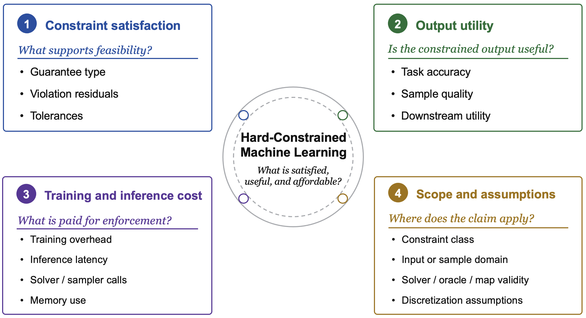

# Awesome Hard-Constrained Machine Learning

[](https://awesome.re)

> A curated paper and resource list for understanding machine learning methods that enforce hard constraints in prediction and generation.

This repository follows the style of awesome survey repositories: a compact roadmap first, then categorized paper lists and resource links. The taxonomy follows the companion survey on hard-constrained machine learning.

## News

- 2026-06: Initialized the reader-facing paper list, taxonomy pages, method cards, and evaluation guide.

## Table of Contents

- [Overview](#overview)
- [How to Read This List](#how-to-read-this-list)
- [Survey and Background](#survey-and-background)
- [Foundations](#foundations)
- [Paper List](#paper-list)
  - [Hard-Constrained Prediction](#hard-constrained-prediction)
  - [Hard-Constrained Generation](#hard-constrained-generation)
  - [Applications and Benchmarks](#applications-and-benchmarks)
- [Reader Guides](#reader-guides)
- [Data Files](#data-files)
- [Citation](#citation)

## Overview

Hard-constrained ML asks for outputs that are not merely accurate or high quality, but also feasible under explicit constraints. The central comparison axes are:

- **Constraint satisfaction**: what supports feasibility?
- **Output utility**: is the constrained output still useful?
- **Training and inference cost**: what is paid for enforcement?
- **Scope and assumptions**: where does the claim apply?



## How to Read This List

Each paper should be read by mechanism and guarantee basis, not only by application domain.

- Use [Start Here](docs/start-here.md) for the basic framing.
- Use [Which Method Family?](docs/reader-guide/which-method-family.md) to map a problem setting to candidate method families.
- Use [How to Read a Hard-Constraint Claim](docs/reader-guide/how-to-read-a-hard-constraint-claim.md) to evaluate feasibility claims.
- Use [Guarantee Terminology](docs/evaluation/guarantee-terminology.md) to separate by-construction, solver-tolerance, certified, probabilistic, and empirical claims.

## Survey and Background

| Title | Venue | Year | Links |
|---|---|---:|---|
| Physics-informed machine learning | Nature Reviews Physics | 2021 | - |
| [Physics-informed machine learning: A survey on problems, methods and applications](https://arxiv.org/pdf/2211.08064) | arXiv preprint arXiv:2211.08064 | 2022 | [paper](https://arxiv.org/pdf/2211.08064) |
| Physics-informed computer vision: A review and perspectives | ACM Computing Surveys | 2024 | - |
| Understanding physics-informed neural networks: techniques, applications, trends, and challenges | AI | 2024 | - |
| When physics meets machine learning: A survey of physics-informed machine learning | Machine Learning for Computational Science and Engineering | 2025 | - |
| Geometric deep learning: going beyond euclidean data | IEEE Signal Processing Magazine | 2017 | - |
| [Geometric deep learning: Grids, groups, graphs, geodesics, and gauges](https://arxiv.org/pdf/2104.13478) | arXiv preprint arXiv:2104.13478 | 2021 | [paper](https://arxiv.org/pdf/2104.13478) |
| Machine learning for combinatorial optimization: a methodological tour d’horizon | European Journal of Operational Research | 2021 | - |
| Reinforcement learning for combinatorial optimization: A survey | Computers & Operations Research | 2021 | - |
| Machine learning at the service of meta-heuristics for solving combinatorial optimization problems: A state-of-the-art | European Journal of Operational Research | 2022 | - |
| [Learning to optimize: A primer and a benchmark](https://arxiv.org/pdf/2103.12828) | arXiv preprint arXiv:2103.12828 | 2021 | [paper](https://arxiv.org/pdf/2103.12828) |
| [End-to-end constrained optimization learning: A survey](https://arxiv.org/pdf/2103.16378) | arXiv preprint arXiv:2103.16378 | 2021 | [paper](https://arxiv.org/pdf/2103.16378) |
| [Tutorial on amortized optimization for learning to optimize over continuous domains](https://arxiv.org/pdf/2202.00665) | arXiv preprint arXiv:2202.00665 | 2022 | [paper](https://arxiv.org/pdf/2202.00665) |
| Decision-focused learning: Foundations, state of the art, benchmark and future opportunities | Journal of Artificial Intelligence Research | 2024 | - |
| A survey of contextual optimization methods for decision-making under uncertainty | European Journal of Operational Research | 2025 | - |
| [Trustworthy optimization learning: a brief overview](https://doi.org/10.1515/9783111376776-009) | Mathematical Optimization for Machine Learning: Proceedings of the MATH+ Thematic Einstein Semester 2023 | 2025 | [paper](https://doi.org/10.1515/9783111376776-009) |
| [Controllable text generation for large language models: A survey](https://arxiv.org/pdf/2408.12599) | arXiv preprint arXiv:2408.12599 | 2024 | [paper](https://arxiv.org/pdf/2408.12599) |

## Foundations

| Title | Venue | Year | Links |
|---|---|---:|---|
| Multilayer feedforward networks are universal approximators | Neural networks | 1989 | - |
| Recurrent neural networks are universal approximators | International conference on artificial neural networks | 2006 | - |
| [Are transformers universal approximators of sequence-to-sequence functions?](https://arxiv.org/pdf/1912.10077) | arXiv preprint arXiv:1912.10077 | 2019 | [paper](https://arxiv.org/pdf/1912.10077) |
| Universal approximation with deep narrow networks | Conference on learning theory | 2020 | - |
| Universality of deep convolutional neural networks | Applied and computational harmonic analysis | 2020 | - |
| Universal approximation of functions on sets | Journal of Machine Learning Research | 2022 | - |
| Universal approximation theorems for differentiable geometric deep learning | Journal of Machine Learning Research | 2022 | - |
| Multilayer feedforward networks with a nonpolynomial activation function can approximate any function | Neural networks | 1993 | - |
| Characterizing ResNet’s Universal Approximation Capability | Proceedings of the Forty-first International Conference on Machine Learning | 2024 | - |
| Pattern recognition and machine learning | Springer | 2006 | - |
| ImageNet classification with deep convolutional neural networks | Communications of the ACM | 2017 | - |
| Probabilistic graphical models: principles and techniques | MIT press | 2009 | - |
| [Auto-encoding variational bayes](https://arxiv.org/pdf/1312.6114) | arXiv preprint arXiv:1312.6114 | 2013 | [paper](https://arxiv.org/pdf/1312.6114) |
| Generative adversarial nets | Advances in neural information processing systems | 2014 | - |
| Variational inference with normalizing flows | International conference on machine learning | 2015 | - |
| Denoising diffusion probabilistic models | Advances in Neural Information Processing Systems | 2020 | - |
| [Score-based generative modeling through stochastic differential equations](https://arxiv.org/pdf/2011.13456) | arXiv preprint arXiv:2011.13456 | 2020 | [paper](https://arxiv.org/pdf/2011.13456) |
| [Flow matching for generative modeling](https://arxiv.org/pdf/2210.02747) | arXiv preprint arXiv:2210.02747 | 2022 | [paper](https://arxiv.org/pdf/2210.02747) |
| [Flow straight and fast: Learning to generate and transfer data with rectified flow](https://arxiv.org/pdf/2209.03003) | arXiv preprint arXiv:2209.03003 | 2022 | [paper](https://arxiv.org/pdf/2209.03003) |
| Convex optimization | Cambridge university press | 2004 | - |
| [Reflected Flow Matching](https://arxiv.org/pdf/2405.16577) | arXiv preprint arXiv:2405.16577 | 2024 | [paper](https://arxiv.org/pdf/2405.16577) |
| [Flowmm: Generating materials with riemannian flow matching](https://arxiv.org/pdf/2406.04713) | arXiv preprint arXiv:2406.04713 | 2024 | [paper](https://arxiv.org/pdf/2406.04713) |
| Riemannian score-based generative modelling | Advances in neural information processing systems | 2022 | - |
| [Flow Matching on General Geometries](https://openreview.net/forum?id=g7ohDlTITL) | The Twelfth International Conference on Learning Representations | 2024 | [paper](https://openreview.net/forum?id=g7ohDlTITL) |
| Metric flow matching for smooth interpolations on the data manifold | Advances in Neural Information Processing Systems | 2024 | - |
| Differentiable convex optimization layers | Advances in neural information processing systems | 2019 | - |
| Efficient projection-free online convex optimization with membership oracle | Conference on Learning Theory | 2022 | - |
| CVXPY: A Python-embedded modeling language for convex optimization | The Journal of Machine Learning Research | 2016 | - |
| [Chance-constrained Flow Matching for High-Fidelity Constraint-aware Generation](https://arxiv.org/pdf/2509.25157) | arXiv preprint arXiv:2509.25157 | 2025 | [paper](https://arxiv.org/pdf/2509.25157) |
| Gauge flow matching for efficient constrained generative modeling over general convex set | ICLR 2025 Workshop on Deep Generative Model in Machine Learning: Theory, Principle and Efficacy | 2025 | - |

## Paper List

### Hard-Constrained Prediction

#### Lagrangian and primal-dual training

| Title | Venue | Year | Links |
|---|---|---:|---|
| Constrained learning with non-convex losses | IEEE Transactions on Information Theory | 2022 | [card](docs/methods/chamon2022constrained.md) |
| [Learning to solve the AC optimal power flow via a lagrangian approach](https://arxiv.org/pdf/2110.01653) | arXiv preprint arXiv:2110.01653 | 2022 | [paper](https://arxiv.org/pdf/2110.01653) |
| Resilient constrained learning | Advances in Neural Information Processing Systems | 2023 | - |
| [Self-supervised equality embedded deep lagrange dual for approximate constrained optimization](https://arxiv.org/pdf/2306.06674) | arXiv preprint arXiv:2306.06674 | 2023 | [paper](https://arxiv.org/pdf/2306.06674) |
| Self-supervised primal-dual learning for constrained optimization | Proceedings of the AAAI Conference on Artificial Intelligence | 2023 | [card](docs/methods/park2022self.md) |
| Constrained diffusion models via dual training | Advances in Neural Information Processing Systems | 2024 | [card](docs/methods/khalafi2024constrained.md) |
| [Constrained optimization for machine learning: algorithms and applications](https://hdl.handle.net/1866/33886) | PhD thesis | 2024 | [paper](https://hdl.handle.net/1866/33886) |
| Dual lagrangian learning for conic optimization | Advances in Neural Information Processing Systems | 2024 | [card](docs/methods/tanneau2024dual.md) |
| [Learning constrained optimization with deep augmented lagrangian methods](https://arxiv.org/pdf/2403.03454) | arXiv preprint arXiv:2403.03454 | 2024 | [paper](https://arxiv.org/pdf/2403.03454) |
| [Near-Optimal Solutions of Constrained Learning Problems](https://openreview.net/forum?id=fDaLmkdSKU) | The Twelfth International Conference on Learning Representations | 2024 | [paper](https://openreview.net/forum?id=fDaLmkdSKU) |
| Self-supervised learning for large-scale preventive security constrained dc optimal power flow | IEEE Transactions on Power Systems | 2024 | - |
| [AL-CoLe: Augmented Lagrangian for Constrained Learning](https://arxiv.org/pdf/2510.20995) | arXiv preprint arXiv:2510.20995 | 2025 | [paper](https://arxiv.org/pdf/2510.20995) |
| [Alignment of large language models with constrained learning](https://arxiv.org/pdf/2505.19387) | arXiv preprint arXiv:2505.19387 | 2025 | [paper](https://arxiv.org/pdf/2505.19387) |
| [Learning (approximately) equivariant networks via constrained optimization](https://arxiv.org/pdf/2505.13631) | arXiv preprint arXiv:2505.13631 | 2025 | [paper](https://arxiv.org/pdf/2505.13631) |
| [Learning Optimal Power Flow with Pointwise Constraints](https://arxiv.org/pdf/2510.20777) | arXiv preprint arXiv:2510.20777 | 2025 | [paper](https://arxiv.org/pdf/2510.20777) |
| [Learning with Statistical Equality Constraints](https://arxiv.org/pdf/2511.14320) | arXiv preprint arXiv:2511.14320 | 2025 | [paper](https://arxiv.org/pdf/2511.14320) |
| [Breaking Safety Paradox with Feasible Dual Policy Iteration](https://openreview.net/forum?id=BHSSV1nHvU) | The Fourteenth International Conference on Learning Representations | 2026 | [paper](https://openreview.net/forum?id=BHSSV1nHvU) |
| [Unrolled Neural Networks for Constrained Optimization](https://arxiv.org/pdf/2601.17274) | arXiv preprint arXiv:2601.17274 | 2026 | [paper](https://arxiv.org/pdf/2601.17274) |

#### Decision-focused feasibility

| Title | Venue | Year | Links |
|---|---|---:|---|
| [Feasibility-Aware Decision-Focused Learning for Predicting Parameters in the Constraints](https://openreview.net/forum?id=eTmvwxohRx) | The Thirty-ninth Annual Conference on Neural Information Processing Systems | 2025 | [paper](https://openreview.net/forum?id=eTmvwxohRx) |

#### Feasible-set parameterization

| Title | Venue | Year | Links |
|---|---|---:|---|
| Homogeneous linear inequality constraints for neural network activations | Proceedings of the IEEE/CVF Conference on Computer Vision and Pattern Recognition Workshops | 2020 | [card](docs/methods/frerix2020homogeneous.md) |
| Safe reinforcement learning of control-affine systems with vertex networks | Learning for Dynamics and Control | 2021 | [card](docs/methods/zheng2021safe.md) |
| Computationally efficient safe reinforcement learning for power systems | 2022 American Control Conference (ACC) | 2022 | [card](docs/methods/tabas2022computationally.md) |
| Learning to solve optimization problems with hard linear constraints | IEEE Access | 2023 | [card](docs/methods/li2023learning.md) |
| Reflected diffusion models | International Conference on Machine Learning | 2023 | [card](docs/methods/lou2023reflected.md) |
| Mirror diffusion models for constrained and watermarked generation | Advances in Neural Information Processing Systems | 2024 | [card](docs/methods/liu2024mirror.md) |
| [Neural Approximate Mirror Maps for Constrained Diffusion Models](https://arxiv.org/pdf/2406.12816) | arXiv preprint arXiv:2406.12816 | 2024 | [paper](https://arxiv.org/pdf/2406.12816), [card](docs/methods/feng2024neural.md) |
| Fast Projection-Free Approach (without Optimization Oracle) for Optimization over Compact Convex Set | The Thirty-ninth Annual Conference on Neural Information Processing Systems | 2025 | [card](docs/methods/liu2025fast.md) |
| [Flows on convex polytopes](https://arxiv.org/pdf/2503.10232) | arXiv preprint arXiv:2503.10232 | 2025 | [paper](https://arxiv.org/pdf/2503.10232), [card](docs/methods/diederen2025flows.md) |
| [Geometric Algorithms for Neural Combinatorial Optimization with Constraints](https://openreview.net/forum?id=EPDLFWyNnF) | The Thirty-ninth Annual Conference on Neural Information Processing Systems | 2025 | [paper](https://openreview.net/forum?id=EPDLFWyNnF), [card](docs/methods/karalias2025geometric.md) |
| [HoP: Homeomorphic Polar Learning for Hard Constrained Optimization](https://arxiv.org/pdf/2502.00304) | arXiv preprint arXiv:2502.00304 | 2025 | [paper](https://arxiv.org/pdf/2502.00304), [card](docs/methods/deng2025hop.md) |
| [CAffNet: Hard Constraint-Affine Neural Networks](https://arxiv.org/pdf/2605.24437) | arXiv preprint arXiv:2605.24437 | 2026 | [paper](https://arxiv.org/pdf/2605.24437), [card](docs/methods/zhao2026caffnet.md) |
| [Categorical Flow Maps](https://arxiv.org/pdf/2602.12233) | arXiv preprint arXiv:2602.12233 | 2026 | [paper](https://arxiv.org/pdf/2602.12233) |
| [Improving Feasibility via Fast Autoencoder-Based Projections](https://openreview.net/forum?id=dVlkUtsyg7) | The Fourteenth International Conference on Learning Representations | 2026 | [paper](https://openreview.net/forum?id=dVlkUtsyg7), [card](docs/methods/chzhen2026improving.md) |

#### Learned constraints and feasibility guarantees

| Title | Venue | Year | Links |
|---|---|---:|---|
| [Conformal Mixed-Integer Constraint Learning with Feasibility Guarantees](https://openreview.net/forum?id=ZvUZvT8tgg) | The Thirty-ninth Annual Conference on Neural Information Processing Systems | 2025 | [paper](https://openreview.net/forum?id=ZvUZvT8tgg) |

#### Penalty/adversarial training

| Title | Venue | Year | Links |
|---|---|---:|---|
| Deepopf: A deep neural network approach for security-constrained dc optimal power flow | 2019 IEEE International Conference on Communications, Control, and Computing Technologies for Smart Grids (SmartGridComm) | 2019 | - |
| End-to-end safe reinforcement learning through barrier functions for safety-critical continuous control tasks | Proceedings of the AAAI Conference on Artificial Intelligence | 2019 | [card](docs/methods/cheng2019end.md) |
| Deepopf: A deep neural network approach for security-constrained dc optimal power flow | IEEE Transactions on Power Systems | 2020 | [card](docs/methods/pan2020deepopf.md) |
| Learning optimal solutions for extremely fast AC optimal power flow | 2020 IEEE International Conference on Communications, Control, and Computing Technologies for Smart Grids (SmartGridComm) | 2020 | - |
| Predicting ac optimal power flows: Combining deep learning and lagrangian dual methods | Proceedings of the AAAI Conference on Artificial Intelligence | 2020 | - |
| A convex neural network solver for dcopf with generalization guarantees | IEEE Transactions on Control of Network Systems | 2021 | - |
| [Physics-Informed Neural Networks for AC Optimal Power Flow](https://arxiv.org/pdf/2110.02672) | arXiv preprint arXiv:2110.02672 | 2021 | [paper](https://arxiv.org/pdf/2110.02672) |
| Physics-informed neural networks for minimising worst-case violations in dc optimal power flow | 2021 IEEE International Conference on Communications, Control, and Computing Technologies for Smart Grids (SmartGridComm) | 2021 | - |
| Constrained deep networks: Lagrangian optimization via log-barrier extensions | 2022 30th European Signal Processing Conference (EUSIPCO) | 2022 | - |
| [Minimizing worst-case violations of neural networks](https://arxiv.org/pdf/2212.10930) | arXiv preprint arXiv:2212.10930 | 2022 | [paper](https://arxiv.org/pdf/2212.10930) |
| Enriching neural network training dataset to improve worst-case performance guarantees | 2023 IEEE Belgrade PowerTech | 2023 | - |
| [Neural Networks for AC Optimal Power Flow: Improving Worst-Case Guarantees during Training](https://arxiv.org/pdf/2510.23196) | arXiv preprint arXiv:2510.23196 | 2025 | [paper](https://arxiv.org/pdf/2510.23196) |

#### Post-processing and projection

| Title | Venue | Year | Links |
|---|---|---:|---|
| Learning warm-start points for AC optimal power flow | 2019 IEEE 29th International Workshop on Machine Learning for Signal Processing (MLSP) | 2019 | - |
| Warm-starting AC optimal power flow with graph neural networks | 33rd Conference on Neural Information Processing Systems (NeurIPS 2019) | 2019 | [card](docs/methods/diehl2019warm.md) |
| Improving diffusion models for inverse problems using manifold constraints | Advances in Neural Information Processing Systems | 2022 | [card](docs/methods/chung2022improving.md) |
| End-to-end learning to warm-start for real-time quadratic optimization | Learning for Dynamics and Control Conference | 2023 | - |
| Low complexity homeomorphic projection to ensure neural-network Solution feasibility for optimization over (non-) convex set | Proceedings of the 40th International Conference on Machine Learning | 2023 | [card](docs/methods/liang2023hp.md) |
| Constrained Synthesis with Projected Diffusion Models | The Thirty-eighth Annual Conference on Neural Information Processing Systems | 2024 | [card](docs/methods/christopher2024constrained.md) |
| Homeomorphic projection to ensure neural-network solution feasibility for constrained optimization | Journal of Machine Learning Research | 2024 | [card](docs/methods/liang2024hp.md) |
| Learning to warm-start fixed-point optimization algorithms | Journal of Machine Learning Research | 2024 | [card](docs/methods/sambharya2024learning.md) |
| [Constrained discrete diffusion](https://arxiv.org/pdf/2503.09790) | arXiv preprint arXiv:2503.09790 | 2025 | [paper](https://arxiv.org/pdf/2503.09790), [card](docs/methods/cardei2025constrained.md) |
| Constrained generative modeling with manually bridged diffusion models | Proceedings of the AAAI Conference on Artificial Intelligence | 2025 | [card](docs/methods/naderiparizi2025constrained.md) |
| [Training-Free Constrained Generation With Stable Diffusion Models](https://openreview.net/forum?id=TrNB08KuHK) | The Thirty-ninth Annual Conference on Neural Information Processing Systems | 2025 | [paper](https://openreview.net/forum?id=TrNB08KuHK), [card](docs/methods/zampini2025trainingfree.md) |

#### Provable guarantees and verification

| Title | Venue | Year | Links |
|---|---|---:|---|
| [Evaluating robustness of neural networks with mixed integer programming](https://arxiv.org/pdf/1711.07356) | arXiv preprint arXiv:1711.07356 | 2017 | [paper](https://arxiv.org/pdf/1711.07356) |
| [Training for faster adversarial robustness verification via inducing relu stability](https://arxiv.org/pdf/1809.03008) | arXiv preprint arXiv:1809.03008 | 2018 | [paper](https://arxiv.org/pdf/1809.03008) |
| [Verification of non-linear specifications for neural networks](https://arxiv.org/pdf/1902.09592) | arXiv preprint arXiv:1902.09592 | 2019 | [paper](https://arxiv.org/pdf/1902.09592) |
| DeepOPF+: A deep neural network approach for DC optimal power flow for ensuring feasibility | 2020 IEEE International Conference on Communications, Control, and Computing Technologies for Smart Grids (SmartGridComm) | 2020 | [card](docs/methods/zhao2020deepopf+.md) |
| Learning optimal power flow: Worst-case guarantees for neural networks | 2020 IEEE International Conference on Communications, Control, and Computing Technologies for Smart Grids (SmartGridComm) | 2020 | - |
| Safety verification and robustness analysis of neural networks via quadratic constraints and semidefinite programming | IEEE Transactions on Automatic Control | 2020 | - |
| Verification of neural network behaviour: Formal guarantees for power system applications | IEEE Transactions on Smart Grid | 2020 | - |
| Beta-CROWN: Efficient bound propagation with per-neuron split constraints for complete and incomplete neural network verification | Advances in Neural Information Processing Systems | 2021 | - |
| [Ensuring DNN solution feasibility for optimization problems with convex constraints and its application to DC optimal power flow problems](https://arxiv.org/pdf/2112.08091) | arXiv preprint arXiv:2112.08091 | 2021 | [paper](https://arxiv.org/pdf/2112.08091) |
| Provable repair of deep neural networks | Proceedings of the 42nd ACM SIGPLAN international conference on programming language design and implementation | 2021 | [card](docs/methods/sotoudeh2021provable.md) |
| Learning neural networks under input-output specifications | 2022 American Control Conference (ACC) | 2022 | - |
| Architecture-preserving provable repair of deep neural networks | Proceedings of the ACM on Programming Languages | 2023 | - |
| POLICE: Provably optimal linear constraint enforcement for deep neural networks | ICASSP 2023-2023 IEEE International Conference on Acoustics, Speech and Signal Processing (ICASSP) | 2023 | - |
| [POLICEd RL: Learning closed-loop robot control policies with provable satisfaction of hard constraints](https://arxiv.org/pdf/2403.13297) | arXiv preprint arXiv:2403.13297 | 2024 | [paper](https://arxiv.org/pdf/2403.13297) |
| Provable Editing of Deep Neural Networks using Parametric Linear Relaxation | Advances in Neural Information Processing Systems | 2024 | [card](docs/methods/tao2024provable.md) |
| Provable Gradient Editing of Deep Neural Networks | The Thirty-ninth Annual Conference on Neural Information Processing Systems | 2025 | - |
| Provably-safe neural network training using hybrid zonotope reachability analysis | 2025 IEEE 64th Conference on Decision and Control (CDC) | 2025 | - |
| [UniConFlow: A Unified Constrained Flow-Matching Framework for Certified Motion Planning](https://arxiv.org/pdf/2506.02955) | arXiv preprint arXiv:2506.02955 | 2025 | [paper](https://arxiv.org/pdf/2506.02955) |
| [mPOLICE: Provable Enforcement of Multi-Region Affine Constraints in Deep Neural Networks](https://arxiv.org/pdf/2502.02434) | arXiv preprint arXiv:2502.02434 | 2025 | [paper](https://arxiv.org/pdf/2502.02434) |
| [Constrained Policy Optimization via Sampling-Based Weight-Space Projection](https://arxiv.org/pdf/2512.13788) | arXiv preprint arXiv:2512.13788 | 2026 | [paper](https://arxiv.org/pdf/2512.13788), [card](docs/methods/cao2026scpo.md) |
| [SnareNet: Flexible Repair Layers for Neural Networks with Hard Constraints](https://arxiv.org/pdf/2602.09317) | arXiv preprint arXiv:2602.09317 | 2026 | [paper](https://arxiv.org/pdf/2602.09317), [card](docs/methods/chu2026snarenet.md) |

#### Structured feasibility layers

| Title | Venue | Year | Links |
|---|---|---:|---|
| Optnet: Differentiable optimization as a layer in neural networks | International Conference on Machine Learning | 2017 | [card](docs/methods/amos2017optnet.md) |
| [DC3: A learning method for optimization with hard constraints](https://arxiv.org/pdf/2104.12225) | arXiv preprint arXiv:2104.12225 | 2020 | [paper](https://arxiv.org/pdf/2104.12225), [card](docs/methods/donti2021dc3.md) |
| Enforcing policy feasibility constraints through differentiable projection for energy optimization | Proceedings of the Twelfth ACM International Conference on Future Energy Systems | 2021 | [card](docs/methods/chen2021enforcing.md) |
| Feasibility-based fixed point networks | Fixed Point Theory and Algorithms for Sciences and Engineering | 2021 | [card](docs/methods/heaton2021feasibility.md) |
| [Alternating differentiation for optimization layers](https://arxiv.org/pdf/2210.01802) | arXiv preprint arXiv:2210.01802 | 2022 | [paper](https://arxiv.org/pdf/2210.01802) |
| DeepOPF: A feasibility-optimized deep neural network approach for AC optimal power flow problems | IEEE Systems Journal | 2022 | [card](docs/methods/pan2022deepopf.md) |
| Efficient and modular implicit differentiation | Advances in neural information processing systems | 2022 | - |
| [Safe and efficient model predictive control using neural networks: An interior point approach](https://arxiv.org/pdf/2203.12196) | arXiv preprint arXiv:2203.12196 | 2022 | [paper](https://arxiv.org/pdf/2203.12196), [card](docs/methods/tabas2022safe.md) |
| Wasserstein-Based Projections with Applications to Inverse Problems | SIAM Journal on Mathematics of Data Science | 2022 | [card](docs/methods/heaton2022wasserstein.md) |
| A new computationally simple approach for implementing neural networks with output hard constraints | Doklady Mathematics | 2023 | [card](docs/methods/konstantinov2023new.md) |
| [Neural Fields with Hard Constraints of Arbitrary Differential Order](https://openreview.net/forum?id=oO1IreC6Sd) | Thirty-seventh Conference on Neural Information Processing Systems | 2023 | [paper](https://openreview.net/forum?id=oO1IreC6Sd) |
| One-step differentiation of iterative algorithms | Advances in Neural Information Processing Systems | 2023 | - |
| [RAYEN: Imposition of Hard Convex Constraints on Neural Networks](https://arxiv.org/pdf/2307.08336) | arXiv preprint arXiv:2307.08336 | 2023 | [paper](https://arxiv.org/pdf/2307.08336), [card](docs/methods/tordesillas2023rayen.md) |
| [Toward Rapid, Optimal, and Feasible Power Dispatch through Generalized Neural Mapping](https://arxiv.org/pdf/2311.04838) | arXiv preprint arXiv:2311.04838 | 2023 | [paper](https://arxiv.org/pdf/2311.04838), [card](docs/methods/li2023toward.md) |
| [Dual interior point optimization learning](https://arxiv.org/pdf/2402.02596) | arXiv preprint arXiv:2402.02596 | 2024 | [paper](https://arxiv.org/pdf/2402.02596), [card](docs/methods/klamkin2024dual.md) |
| GLinSAT: The general linear satisfiability neural network layer by accelerated gradient descent | Advances in Neural Information Processing Systems | 2024 | [card](docs/methods/zeng2024glinsat.md) |
| Imposing Star-Shaped Hard Constraints on the Neural Network Output | Mathematics | 2024 | [card](docs/methods/konstantinov2024imposing.md) |
| [Learning to optimize for mixed-integer non-linear programming with feasibility guarantees](https://arxiv.org/pdf/2410.11061) | arXiv preprint arXiv:2410.11061 | 2024 | [paper](https://arxiv.org/pdf/2410.11061), [card](docs/methods/tang2024learning.md) |
| [Leveraging Augmented-Lagrangian Techniques for Differentiating over Infeasible Quadratic Programs in Machine Learning](https://openreview.net/forum?id=YCPDFfmkFr) | The Twelfth International Conference on Learning Representations | 2024 | [paper](https://openreview.net/forum?id=YCPDFfmkFr), [card](docs/methods/bambade2024leveraging.md) |
| [QCQP-Net: Reliably Learning Feasible Alternating Current Optimal Power Flow Solutions Under Constraints](https://arxiv.org/pdf/2401.06820) | arXiv preprint arXiv:2401.06820 | 2024 | [paper](https://arxiv.org/pdf/2401.06820), [card](docs/methods/zeng2024qcqp.md) |
| [Scaling physics-informed hard constraints with mixture-of-experts](https://openreview.net/forum?id=u3dX2CEIZb) | The Twelfth International Conference on Learning Representations | 2024 | [paper](https://openreview.net/forum?id=u3dX2CEIZb), [card](docs/methods/chalapathi2024scaling.md) |
| Constraint boundary wandering framework: Enhancing constrained optimization with deep neural networks | IEEE Transactions on Pattern Analysis and Machine Intelligence | 2025 | [card](docs/methods/wu2025constraint.md) |
| [ENFORCE: Nonlinear constrained learning with adaptive-depth neural projection](https://arxiv.org/pdf/2502.06774) | arXiv preprint arXiv:2502.06774 | 2025 | [paper](https://arxiv.org/pdf/2502.06774), [card](docs/methods/lastrucci2025enforce.md) |
| Efficient Bisection Projection to Ensure Neural-Network Solution Feasibility for Optimization over General Set | Proceedings of the Forty-second International Conference on Machine Learning | 2025 | [card](docs/methods/liang2024bis.md) |
| [End-to-end probabilistic framework for learning with hard constraints](https://arxiv.org/pdf/2506.07003) | arXiv preprint arXiv:2506.07003 | 2025 | [paper](https://arxiv.org/pdf/2506.07003), [card](docs/methods/utkarsh2025end.md) |
| [Enforcing Hard Linear Constraints in Deep Learning Models with Decision Rules](https://openreview.net/forum?id=gjiCml2CNG) | The Thirty-ninth Annual Conference on Neural Information Processing Systems | 2025 | [paper](https://openreview.net/forum?id=gjiCml2CNG), [card](docs/methods/constante2025enforcing.md) |
| [Enforcing convex constraints in Graph Neural Networks](https://arxiv.org/pdf/2510.11227) | arXiv preprint arXiv:2510.11227 | 2025 | [paper](https://arxiv.org/pdf/2510.11227), [card](docs/methods/rashwan2025enforcing.md) |
| [FSNet: Feasibility-Seeking Neural Network for Constrained Optimization with Guarantees](https://openreview.net/forum?id=oum1txoy1D) | The Thirty-ninth Annual Conference on Neural Information Processing Systems | 2025 | [paper](https://openreview.net/forum?id=oum1txoy1D), [card](docs/methods/nguyen2025fsnet.md) |
| [T-SKM-Net: Trainable Neural Network Framework for Linear Constraint Satisfaction via Sampling Kaczmarz-Motzkin Method](https://arxiv.org/pdf/2512.10461) | arXiv preprint arXiv:2512.10461 | 2025 | [paper](https://arxiv.org/pdf/2512.10461), [card](docs/methods/zhu2025t.md) |
| [Deep FlexQP: Accelerated Nonlinear Programming via Deep Unfolding](https://openreview.net/forum?id=HL3TvE4Afm) | The Fourteenth International Conference on Learning Representations | 2026 | [paper](https://openreview.net/forum?id=HL3TvE4Afm), [card](docs/methods/oshin2026deep.md) |
| [HardNet++: Nonlinear Constraint Enforcement in Neural Networks](https://arxiv.org/pdf/2604.19669) | arXiv preprint arXiv:2604.19669 | 2026 | [paper](https://arxiv.org/pdf/2604.19669), [card](docs/methods/goertzen2026hardnetpp.md) |
| [LMI-Net: Linear Matrix Inequality-Constrained Neural Networks via Differentiable Projection Layers](https://arxiv.org/pdf/2604.05374) | arXiv preprint arXiv:2604.05374 | 2026 | [paper](https://arxiv.org/pdf/2604.05374), [card](docs/methods/tang2026lminet.md) |
| [Pinet: Optimizing hard-constrained neural networks with orthogonal projection layers](https://openreview.net/forum?id=EJ680UQeZG) | The Fourteenth International Conference on Learning Representations | 2026 | [paper](https://openreview.net/forum?id=EJ680UQeZG), [card](docs/methods/grontas2025pinet.md) |
| [Soft-Radial Projection for Constrained End-to-End Learning](https://arxiv.org/pdf/2602.03461) | arXiv preprint arXiv:2602.03461 | 2026 | [paper](https://arxiv.org/pdf/2602.03461), [card](docs/methods/schneider2026soft.md) |

### Hard-Constrained Generation

#### Guided generation and correction

| Title | Venue | Year | Links |
|---|---|---:|---|
| [Learning Diffusion Bridges on Constrained Domains](https://openreview.net/forum?id=WH1yCa0TbB) | The Eleventh International Conference on Learning Representations | 2023 | [paper](https://openreview.net/forum?id=WH1yCa0TbB), [card](docs/methods/liu2023learning.md) |
| [Constrained Diffusion with Trust Sampling](https://openreview.net/forum?id=dJUb9XRoZI) | The Thirty-eighth Annual Conference on Neural Information Processing Systems | 2024 | [paper](https://openreview.net/forum?id=dJUb9XRoZI), [card](docs/methods/huang2024constrained.md) |
| [Gradient-free generation for hard-constrained systems](https://arxiv.org/pdf/2412.01786) | arXiv preprint arXiv:2412.01786 | 2024 | [paper](https://arxiv.org/pdf/2412.01786), [card](docs/methods/cheng2024gradient.md) |
| [Constrained Diffusion for Protein Design with Hard Structural Constraints](https://arxiv.org/pdf/2510.14989) | arXiv preprint arXiv:2510.14989 | 2025 | [paper](https://arxiv.org/pdf/2510.14989), [card](docs/methods/christopher2025constrained.md) |
| [Constrained Posterior Sampling: Time Series Generation with Hard Constraints](https://proceedings.neurips.cc/paper_files/paper/2025/file/9b01c4a7d3fc49875dad3c13848bcd9e-Paper-Conference.pdf) | The Thirty-ninth Annual Conference on Neural Information Processing Systems | 2025 | [paper](https://proceedings.neurips.cc/paper_files/paper/2025/file/9b01c4a7d3fc49875dad3c13848bcd9e-Paper-Conference.pdf), [card](docs/methods/narasimhan2025constrained.md) |
| [Constraint-Aware Diffusion Guidance for Robotics: Real-Time Obstacle Avoidance for Autonomous Racing](https://arxiv.org/pdf/2505.13131) | arXiv preprint arXiv:2505.13131 | 2025 | [paper](https://arxiv.org/pdf/2505.13131) |
| [Fast Non-Log-Concave Sampling under Nonconvex Equality and Inequality Constraints with Landing](https://arxiv.org/pdf/2510.22044) | arXiv preprint arXiv:2510.22044 | 2025 | [paper](https://arxiv.org/pdf/2510.22044), [card](docs/methods/jeon2025fast.md) |
| [Fast constrained sampling in pre-trained diffusion models](https://openreview.net/forum?id=3kVM0m60Q5) | The Thirty-ninth Annual Conference on Neural Information Processing Systems | 2025 | [paper](https://openreview.net/forum?id=3kVM0m60Q5), [card](docs/methods/graikos2025fast.md) |
| [HardFlow: Hard-Constrained Sampling for Flow-Matching Models via Trajectory Optimization](https://arxiv.org/pdf/2511.08425) | arXiv preprint arXiv:2511.08425 | 2025 | [paper](https://arxiv.org/pdf/2511.08425), [card](docs/methods/li2025hardflow.md) |
| [Improving Diffusion-based Inverse Algorithms under Few-Step Constraint via Linear Extrapolation](https://openreview.net/forum?id=EGYwfs4XhI) | The Thirty-ninth Annual Conference on Neural Information Processing Systems | 2025 | [paper](https://openreview.net/forum?id=EGYwfs4XhI), [card](docs/methods/zhang2025improving.md) |
| [Linearly Constrained Diffusion Implicit Models](https://openreview.net/forum?id=TYGDG9zEML) | The Thirty-ninth Annual Conference on Neural Information Processing Systems | 2025 | [paper](https://openreview.net/forum?id=TYGDG9zEML), [card](docs/methods/jayaram2025linearly.md) |
| [Local Manifold Approximation and Projection for Manifold-Aware Diffusion Planning](https://openreview.net/forum?id=EHG5Iv1mmb) | Forty-second International Conference on Machine Learning | 2025 | [paper](https://openreview.net/forum?id=EHG5Iv1mmb), [card](docs/methods/lee2025local.md) |
| [Softly Constrained Denoisers for Diffusion Models](https://arxiv.org/pdf/2512.14980) | arXiv preprint arXiv:2512.14980 | 2025 | [paper](https://arxiv.org/pdf/2512.14980), [card](docs/methods/yeom2025softly.md) |
| [UniDB: A Unified Diffusion Bridge Framework via Stochastic Optimal Control](https://arxiv.org/pdf/2502.05749) | arXiv preprint arXiv:2502.05749 | 2025 | [paper](https://arxiv.org/pdf/2502.05749) |
| [FAST-DIPS: Adjoint-Free Analytic Steps and Hard-Constrained Likelihood Correction for Diffusion-Prior Inverse Problems](https://openreview.net/forum?id=voMeZVAkKL) | The Fourteenth International Conference on Learning Representations | 2026 | [paper](https://openreview.net/forum?id=voMeZVAkKL), [card](docs/methods/kim2026fastdips.md) |
| [SafeFlowMatcher: Safe and Fast Planning Using Flow Matching with Control Barrier Functions](https://openreview.net/forum?id=refcXHU1Nh) | The Fourteenth International Conference on Learning Representations | 2026 | [paper](https://openreview.net/forum?id=refcXHU1Nh), [card](docs/methods/yang2026safeflowmatcher.md) |
| [Terminally constrained flow-based generative models from an optimal control perspective](https://arxiv.org/pdf/2601.09474) | arXiv preprint arXiv:2601.09474 | 2026 | [paper](https://arxiv.org/pdf/2601.09474), [card](docs/methods/gao2026terminally.md) |

#### Manifold and geometric modeling

| Title | Venue | Year | Links |
|---|---|---:|---|
| Riemannian diffusion models | Advances in Neural Information Processing Systems | 2022 | [card](docs/methods/huang2022riemannian.md) |
| [Riemannian diffusion schr$$" odinger bridge](https://arxiv.org/pdf/2207.03024) | arXiv preprint arXiv:2207.03024 | 2022 | [paper](https://arxiv.org/pdf/2207.03024) |
| [SE (3) diffusion model with application to protein backbone generation](https://arxiv.org/pdf/2302.02277) | arXiv preprint arXiv:2302.02277 | 2023 | [paper](https://arxiv.org/pdf/2302.02277) |
| Scaling riemannian diffusion models | Advances in Neural Information Processing Systems | 2023 | - |
| Se (3)-diffusionfields: Learning smooth cost functions for joint grasp and motion optimization through diffusion | 2023 IEEE international conference on robotics and automation (ICRA) | 2023 | - |

#### Push-forward and normalizing-flow maps

| Title | Venue | Year | Links |
|---|---|---:|---|
| [FlowPG: Action-Constrained Policy Gradient with Normalizing Flows](https://openreview.net/forum?id=p1gzxzJ4Y5) | Thirty-seventh Conference on Neural Information Processing Systems | 2023 | [paper](https://openreview.net/forum?id=p1gzxzJ4Y5) |

#### Push-forward/autoregressive models

| Title | Venue | Year | Links |
|---|---|---:|---|
| Guided open vocabulary image captioning with constrained beam search | Proceedings of the 2017 Conference on Empirical Methods in Natural Language Processing | 2017 | - |
| Fast lexically constrained decoding with dynamic beam allocation for neural machine translation | Proceedings of the 2018 Conference of the North American Chapter of the Association for Computational Linguistics: Human Language Technologies, Volume 1 (Long Papers) | 2018 | - |
| [Plug and play language models: A simple approach to controlled text generation](https://arxiv.org/pdf/1912.02164) | arXiv preprint arXiv:1912.02164 | 2019 | [paper](https://arxiv.org/pdf/1912.02164) |
| Consistency Models | International Conference on Machine Learning | 2023 | - |
| [Mean Flows for One-step Generative Modeling](https://openreview.net/forum?id=uWj4s7rMnR) | The Thirty-ninth Annual Conference on Neural Information Processing Systems | 2025 | [paper](https://openreview.net/forum?id=uWj4s7rMnR) |
| [One Step Diffusion via Shortcut Models](https://openreview.net/forum?id=OlzB6LnXcS) | The Thirteenth International Conference on Learning Representations | 2025 | [paper](https://openreview.net/forum?id=OlzB6LnXcS) |

#### Reflected or constrained-domain sampling

| Title | Venue | Year | Links |
|---|---|---:|---|
| [Diffusion models for constrained domains](https://arxiv.org/pdf/2304.05364) | arXiv preprint arXiv:2304.05364 | 2023 | [paper](https://arxiv.org/pdf/2304.05364), [card](docs/methods/fishman2023diffusion.md) |
| Gaussian cooling and dikin walks: The interior-point method for logconcave sampling | The Thirty Seventh Annual Conference on Learning Theory | 2024 | - |
| Metropolis sampling for constrained diffusion models | Advances in Neural Information Processing Systems | 2024 | [card](docs/methods/fishman2024metropolis.md) |
| [Reflected Schr$$" odinger Bridge for Constrained Generative Modeling](https://arxiv.org/pdf/2401.03228) | arXiv preprint arXiv:2401.03228 | 2024 | [paper](https://arxiv.org/pdf/2401.03228), [card](docs/methods/deng2024reflected.md) |
| [Efficient Diffusion Models under Nonconvex Equality and Inequality Constraints via Landing](https://arxiv.org/pdf/2604.17838) | Proceedings of the 43rd International Conference on Machine Learning | 2026 | [paper](https://arxiv.org/pdf/2604.17838), [card](docs/methods/jeon2026efficient.md) |

#### Training and fine-tuning

| Title | Venue | Year | Links |
|---|---|---:|---|
| [Optimizing ddpm sampling with shortcut fine-tuning](https://arxiv.org/pdf/2301.13362) | arXiv preprint arXiv:2301.13362 | 2023 | [paper](https://arxiv.org/pdf/2301.13362) |
| [Adjoint matching: Fine-tuning flow and diffusion generative models with memoryless stochastic optimal control](https://arxiv.org/pdf/2409.08861) | arXiv preprint arXiv:2409.08861 | 2024 | [paper](https://arxiv.org/pdf/2409.08861) |
| [Efficient and Guaranteed-Safe Non-Convex Trajectory Optimization with Constrained Diffusion Model](https://arxiv.org/pdf/2403.05571) | arXiv preprint arXiv:2403.05571 | 2024 | [paper](https://arxiv.org/pdf/2403.05571), [card](docs/methods/li2024efficient.md) |
| [Fine-tuning of continuous-time diffusion models as entropy-regularized control](https://arxiv.org/pdf/2402.15194) | arXiv preprint arXiv:2402.15194 | 2024 | [paper](https://arxiv.org/pdf/2402.15194) |
| [Calibrating Generative Models](https://arxiv.org/pdf/2510.10020) | arXiv preprint arXiv:2510.10020 | 2025 | [paper](https://arxiv.org/pdf/2510.10020) |
| [Composition and alignment of diffusion models using constrained learning](https://proceedings.neurips.cc/paper_files/paper/2025/file/1af991de2d4c4e679bcc5d9e23ac6bae-Paper-Conference.pdf) | The Thirty-ninth Annual Conference on Neural Information Processing Systems | 2025 | [paper](https://proceedings.neurips.cc/paper_files/paper/2025/file/1af991de2d4c4e679bcc5d9e23ac6bae-Paper-Conference.pdf) |
| [Physics-Constrained Fine-Tuning of Flow-Matching Models for Generation and Inverse Problems](https://arxiv.org/pdf/2508.09156) | arXiv preprint arXiv:2508.09156 | 2025 | [paper](https://arxiv.org/pdf/2508.09156) |
| [Constraint-Aware Flow Matching: Decision Aligned End-to-End Training for Constrained Sampling](https://arxiv.org/pdf/2605.12754) | arXiv preprint arXiv:2605.12754 | 2026 | [paper](https://arxiv.org/pdf/2605.12754), [card](docs/methods/christopher2026constraintaware.md) |

### Applications and Benchmarks

#### Combinatorial optimization and exact solvers

| Title | Venue | Year | Links |
|---|---|---:|---|
| [Solving Max-Cut to Global Optimality via Feasibility-Preserving Graph Neural Networks](https://arxiv.org/pdf/2605.07113) | arXiv preprint arXiv:2605.07113 | 2026 | [paper](https://arxiv.org/pdf/2605.07113) |

#### Molecule, material, and protein generation

| Title | Venue | Year | Links |
|---|---|---:|---|
| [Constrained Diffusion for Accelerated Structure Relaxation of Inorganic Solids with Point Defects](https://arxiv.org/pdf/2602.19153) | NeurIPS 2025 AI4Mat Workshop | 2026 | [paper](https://arxiv.org/pdf/2602.19153) |
| [Physically Valid Biomolecular Interaction Modeling with Gauss-Seidel Projection](https://openreview.net/forum?id=sJABnBEYeh) | The Fourteenth International Conference on Learning Representations | 2026 | [paper](https://openreview.net/forum?id=sJABnBEYeh) |

#### Optimal power flow and power systems

| Title | Venue | Year | Links |
|---|---|---:|---|
| A survey on applications of machine learning for optimal power flow | 2020 IEEE Texas Power and Energy Conference (TPEC) | 2020 | - |
| Machine learning for optimal power flows | Tutorials in Operations Research: Emerging Optimization Methods and Modeling Techniques with Applications | 2021 | - |
| Fast optimal power flow with guarantees via an unsupervised generative model | IEEE Transactions on Power Systems | 2022 | [card](docs/methods/wang2022fast.md) |
| [Projection-aware Deep Neural Network for DC Optimal Power Flow Without Constraint Violations](https://doi.org/10.1109/SmartGridComm52983.2022.9961047) | 2022 IEEE International Conference on Communications, Control, and Computing Technologies for Smart Grids (SmartGridComm) | 2022 | [paper](https://doi.org/10.1109/SmartGridComm52983.2022.9961047) |
| Advancements and future directions in the application of machine learning to AC optimal power flow: A critical review | Energies | 2024 | - |
| [Equality-embedded augmented Lagrangian neural network for DC optimal power flow](https://doi.org/10.1049/rpg2.13048) | IET Renewable Power Generation | 2024 | [paper](https://doi.org/10.1049/rpg2.13048) |
| [FRMNet: A Feasibility Restoration Mapping Deep Neural Network for AC Optimal Power Flow](https://doi.org/10.1109/TPWRS.2024.3354733) | IEEE Transactions on Power Systems | 2024 | [paper](https://doi.org/10.1109/TPWRS.2024.3354733) |
| Unsupervised Learning for Solving AC Optimal Power Flows: Design, Analysis, and Experiment | IEEE Transactions on Power Systems | 2024 | - |
| [Constrained diffusion models for synthesizing representative power flow datasets](https://arxiv.org/pdf/2506.11281) | arXiv preprint arXiv:2506.11281 | 2025 | [paper](https://arxiv.org/pdf/2506.11281) |
| [DiffOPF: Diffusion Solver for Optimal Power Flow](https://arxiv.org/pdf/2510.14075) | arXiv preprint arXiv:2510.14075 | 2025 | [paper](https://arxiv.org/pdf/2510.14075) |
| [Solving Chance-Constrained AC-OPF Problem by Neural Network with Bisection-based Projection](https://doi.org/10.1145/3679240.3734656) | The 16th ACM International Conference on Future and Sustainable Energy Systems | 2025 | [paper](https://doi.org/10.1145/3679240.3734656), [card](docs/methods/liang2025chanceopf.md) |
| [Towards Trustworthy Learning for Optimal Power Flow: A Physics-informed Diffusion Model](https://ssrn.com/abstract=5854385) | Available at SSRN 5854385 | 2025 | [paper](https://ssrn.com/abstract=5854385) |
| [A hard-constrained NN learning framework for rapidly restoring AC-OPF from DC-OPF](https://arxiv.org/pdf/2602.06255) | arXiv preprint arXiv:2602.06255 | 2026 | [paper](https://arxiv.org/pdf/2602.06255) |

#### Physics-constrained learning and generation

| Title | Venue | Year | Links |
|---|---|---:|---|
| [Hierarchical text-conditional image generation with clip latents](https://arxiv.org/pdf/2204.06125) | arXiv preprint arXiv:2204.06125 | 2022 | [paper](https://arxiv.org/pdf/2204.06125) |
| [DIFUSCO: Graph-based Diffusion Solvers for Combinatorial Optimization](https://arxiv.org/pdf/2302.08224) | arXiv preprint arXiv:2302.08224 | 2023 | [paper](https://arxiv.org/pdf/2302.08224) |
| Diffusion policy: Visuomotor policy learning via action diffusion | The International Journal of Robotics Research | 2023 | - |
| Improving image generation with better captions | Computer Science. https://cdn. openai. com/papers/dall-e-3. pdf | 2023 | - |
| [Solving inverse problems with latent diffusion models via hard data consistency](https://arxiv.org/pdf/2307.08123) | arXiv preprint arXiv:2307.08123 | 2023 | [paper](https://arxiv.org/pdf/2307.08123) |
| T2t: From distribution learning in training to gradient search in testing for combinatorial optimization | Advances in Neural Information Processing Systems | 2023 | - |
| Accurate structure prediction of biomolecular interactions with AlphaFold 3 | Nature | 2024 | - |
| Generative Learning for Solving Non-Convex Problem with Multi-Valued Input-Solution Mapping | 12th International Conference on Learning Representations (ICLR 2024) | 2024 | - |
| A generative model for inorganic materials design | Nature | 2025 | - |

#### Trajectory optimization and manipulation

| Title | Venue | Year | Links |
|---|---|---:|---|
| [MoMaGen: Generating Demonstrations under Soft and Hard Constraints for Multi-Step Bimanual Mobile Manipulation](https://openreview.net/forum?id=bGPDviEtZ1) | The Fourteenth International Conference on Learning Representations | 2026 | [paper](https://openreview.net/forum?id=bGPDviEtZ1) |

#### Trajectory optimization and safe control

| Title | Venue | Year | Links |
|---|---|---:|---|
| Reduced Policy Optimization for Continuous Control with Hard Constraints | Thirty-seventh Conference on Neural Information Processing Systems | 2023 | - |
| [Diffusion predictive control with constraints](https://arxiv.org/pdf/2412.09342) | arXiv preprint arXiv:2412.09342 | 2024 | [paper](https://arxiv.org/pdf/2412.09342) |
| [Multi-Agent Path Finding in Continuous Spaces with Projected Diffusion Models](https://arxiv.org/pdf/2412.17993) | arXiv preprint arXiv:2412.17993 | 2024 | [paper](https://arxiv.org/pdf/2412.17993) |
| [Aligning diffusion model with problem constraints for trajectory optimization](https://arxiv.org/pdf/2504.00342) | arXiv preprint arXiv:2504.00342 | 2025 | [paper](https://arxiv.org/pdf/2504.00342) |
| [Constrained diffusers for safe planning and control](https://arxiv.org/pdf/2506.12544) | arXiv preprint arXiv:2506.12544 | 2025 | [paper](https://arxiv.org/pdf/2506.12544), [card](docs/methods/zhang2025constrained.md) |
| Equality constrained diffusion for direct trajectory optimization | 2025 American Control Conference (ACC) | 2025 | - |
| [Joint Model-based Model-free Diffusion for Planning with Constraints](https://arxiv.org/pdf/2509.08775) | arXiv preprint arXiv:2509.08775 | 2025 | [paper](https://arxiv.org/pdf/2509.08775) |
| [Simultaneous multi-robot motion planning with projected diffusion models](https://arxiv.org/pdf/2502.03607) | arXiv preprint arXiv:2502.03607 | 2025 | [paper](https://arxiv.org/pdf/2502.03607) |
| [Discrete-guided diffusion for scalable and safe multi-robot motion planning](https://ojs.aaai.org/index.php/AAAI/article/download/39512/43473) | Proceedings of the AAAI Conference on Artificial Intelligence | 2026 | [paper](https://ojs.aaai.org/index.php/AAAI/article/download/39512/43473) |
| [GuideFlow: Constraint-guided flow matching for planning in end-to-end autonomous driving](https://openaccess.thecvf.com/content/CVPR2026/papers/Liu_GuideFlow_Constraint-Guided_Flow_Matching_for_Planning_in_End-to-End_Autonomous_Driving_CVPR_2026_paper.pdf) | Proceedings of the IEEE/CVF Conference on Computer Vision and Pattern Recognition | 2026 | [paper](https://openaccess.thecvf.com/content/CVPR2026/papers/Liu_GuideFlow_Constraint-Guided_Flow_Matching_for_Planning_in_End-to-End_Autonomous_Driving_CVPR_2026_paper.pdf) |

## Reader Guides

- [Start Here](docs/start-here.md)
- [Taxonomy Overview](docs/taxonomy/overview.md)
- [Predictive Models](docs/taxonomy/predictive-models.md)
- [Generative Models](docs/taxonomy/generative-models.md)
- [Constraint Families](docs/taxonomy/constraints.md)
- [Reporting Dimensions](docs/evaluation/reporting-dimensions.md)
- [Method Selection Checklist](docs/evaluation/method-selection-checklist.md)
- [Common Failure Modes](docs/reader-guide/common-failure-modes.md)

## Data Files

- [`data/methods.yaml`](data/methods.yaml): method metadata and guarantee summaries.
- [`data/method_timeline.csv`](data/method_timeline.csv): chronological method list.
- [`data/papers.csv`](data/papers.csv): cited-paper index.
- [`tables/`](tables/): CSV slices for major method families.
- [`docs/methods/`](docs/methods/): compact method cards.

## Citation

If this repository helps your work, please cite the companion survey and this repository.

```bibtex
@misc{HardConstrainedMLSurveyRepo,
  title        = {Awesome Hard-Constrained Machine Learning},
  year         = {2026},
  howpublished = {GitHub repository},
  url          = {https://github.com/lem/Hard-Constrained-ML-Survey}
}
```

## Contributing

Suggestions and pull requests are welcome. Please add papers with a clear method family, guarantee basis, and link to the original source when available.
