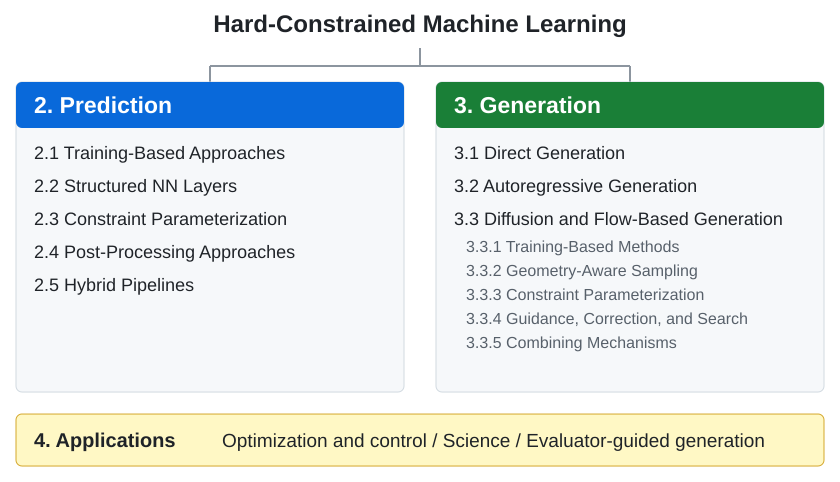
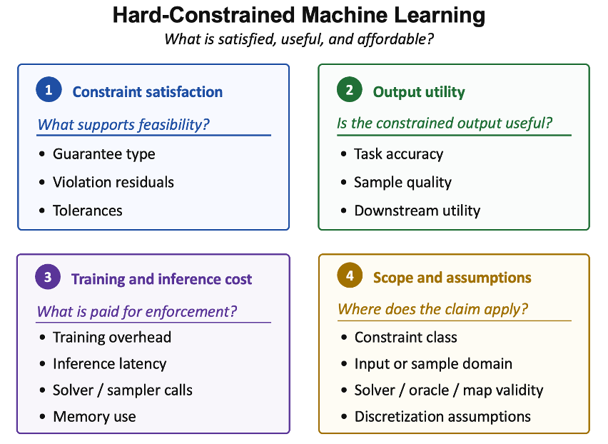

# Awesome Hard-Constrained Machine Learning

[](https://awesome.re)

A categorized collection of papers on hard-constrained **prediction** and **generation**, following our companion survey.

**Survey paper: preprint available soon.** We welcome missed papers and will keep this repository updated.

[Browse papers](#browse-papers) · [Applications](docs/papers/applications.md) · [Resources](#resources) · [Suggest a paper](https://github.com/emliang/Hard-Constrained-ML-Survey/issues)



## Browse Papers

**[1. Related Surveys](docs/papers/surveys.md)** · 16 papers


**[2. Hard-Constrained Prediction](docs/papers/prediction.md)** · 125 papers


- [2.1 Training-Based Approaches](docs/papers/prediction.md#21-training-based-approaches)
- [2.2 Structured NN Layers](docs/papers/prediction.md#22-structured-nn-layers)
- [2.3 Constraint Parameterization](docs/papers/prediction.md#23-constraint-parameterization)
- [2.4 Post-Processing Approaches](docs/papers/prediction.md#24-post-processing-approaches)
- [2.5 Hybrid Pipelines](docs/papers/prediction.md#25-hybrid-pipelines)


**[3. Hard-Constrained Generation](docs/papers/generation.md)** · 141 papers


- [3.1 Direct Generation](docs/papers/generation.md#31-direct-generation)
- [3.2 Autoregressive Generation](docs/papers/generation.md#32-autoregressive-generation)
- [3.3 Diffusion and Flow-Based Generation](docs/papers/generation.md#33-diffusion-and-flow-based-generation)
  - [3.3.1 Training-Based Methods](docs/papers/generation.md#331-training-based-methods)
  - [3.3.2 Geometry-Aware Sampling](docs/papers/generation.md#332-geometry-aware-sampling)
  - [3.3.3 Constraint Parameterization](docs/papers/generation.md#333-constraint-parameterization)
  - [3.3.4 Guidance, Correction, and Search](docs/papers/generation.md#334-guidance-correction-and-search)
  - [3.3.5 Combining Mechanisms](docs/papers/generation.md#335-combining-mechanisms)


**[4. Applications and Evaluation](docs/papers/applications.md)** · 43 papers


- [4.1 AI for Optimization and Control](docs/papers/applications.md#41-ai-for-optimization-and-control)
- [4.2 Scientific Computing and Discovery](docs/papers/applications.md#42-scientific-computing-and-discovery)
- [4.3 Evaluator-Guided Generation](docs/papers/applications.md#43-evaluator-guided-generation)

**308 unique papers.** Counts are unique within each list; papers may appear in several lists. General model foundations are marked as background.

## Applications

[](docs/papers/applications.md)

[Optimal power flow](docs/papers/applications.md#411-optimal-power-flow) · [Trajectory optimization](docs/papers/applications.md#412-trajectory-optimization) · [Physics-informed learning](docs/papers/applications.md#421-physics-informed-learning) · [Molecules and materials](docs/papers/applications.md#422-molecular-and-material-design) · [Evaluator-guided generation](docs/papers/applications.md#43-evaluator-guided-generation)

## Resources

[Paper index (CSV)](data/papers.csv) · [Timeline (CSV)](data/method_timeline.csv) · [BibTeX](data/references.bib)

<details>
<summary>Optional reading aids</summary>

- [How to read a hard-constraint claim](docs/reader-guide/how-to-read-a-hard-constraint-claim.md)
- [Which method family?](docs/reader-guide/which-method-family.md)
- [Guarantee terminology](docs/evaluation/guarantee-terminology.md)
- [Common failure modes](docs/reader-guide/common-failure-modes.md)



</details>

## Next Steps

- [ ] Add representative formulas for each method.
- [ ] Add minimal implementations or pseudocode for explicit comparison.
- [ ] Keep paper coverage and publication metadata updated.

## Contributing

Missing a paper or found a correction? Open an [issue](https://github.com/emliang/Hard-Constrained-ML-Survey/issues) or pull request with the paper link, category, and distinguishing keywords. See [CONTRIBUTING.md](CONTRIBUTING.md).

## Citation

The survey citation will be added when the preprint is available.

<details>
<summary>Repository BibTeX</summary>

```bibtex
@misc{HardConstrainedMLSurveyRepo,
  title = {Awesome Hard-Constrained Machine Learning},
  year = {2026},
  howpublished = {GitHub repository},
  url = {https://github.com/emliang/Hard-Constrained-ML-Survey}
}
```

</details>
